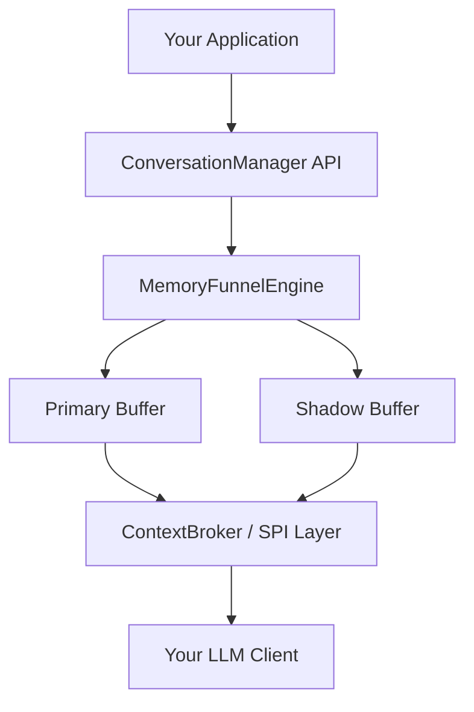
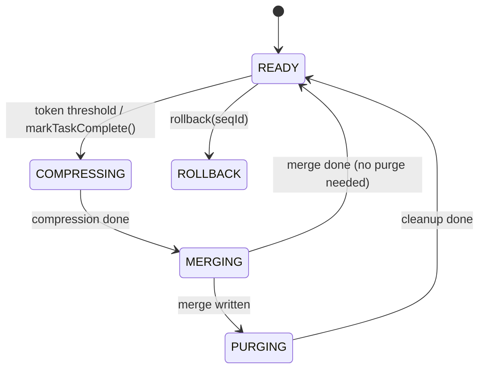
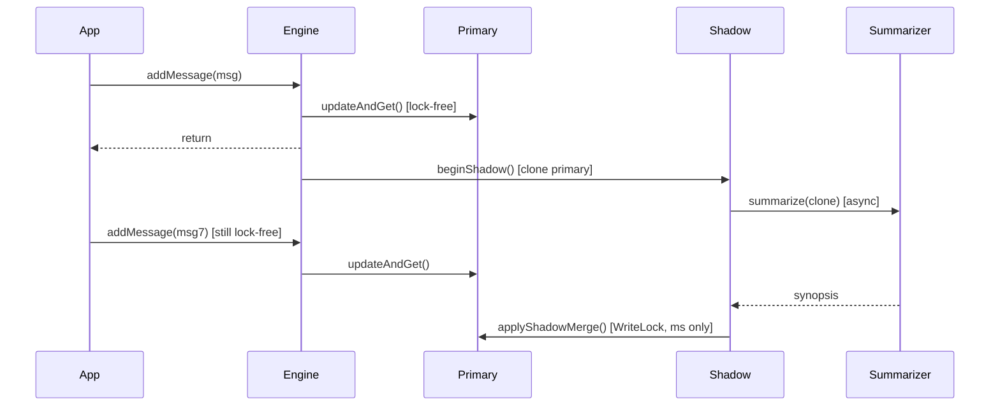

# Agents Guide — Lumi Conversation Manager

[](https://github.com/zheli001/lumi_conversation_manager/releases)
[](https://github.com/zheli001/lumi_conversation_manager/actions)
[](README.md)
[](README.md)

## Table of Contents
- [⚠️ CRITICAL: File Protection Notice](#️-critical-file-protection-notice)
- [🚀 Quick Start](#-quick-start)
- [🧭 Session & Documentation Reference (MUST)](#-session--documentation-reference-must)
- [📏 Documentation & Code Compliance Checklist](#-documentation--code-compliance-checklist)
- [🤖 AI Agent Behavior](#-ai-agent-behavior)
  - [Session Initialization](#session-initialization)
  - [Terminal Environment Detection](#terminal-environment-detection)
  - [Terminal Usage Best Practices](#terminal-usage-best-practices)
  - [Understanding Problems & System Depth](#understanding-problems--system-depth)
  - [Context & Memory Stability](#context--memory-stability)
  - [Task Alignment — Avoiding Task Drift](#task-alignment--avoiding-task-drift)
  - [Code Modification & Project Structure](#code-modification--project-structure)
  - [Debugging & Execution Efficiency](#debugging--execution-efficiency)
  - [Predictability & Interaction Protocol](#predictability--interaction-protocol)
  - [Automatic Command Execution & Error Handling](#automatic-command-execution--error-handling)
  - [Token Limit Management](#token-limit-management)
  - [Code Quality Rules](#code-quality-rules)
- [🏗️ Module Conventions](#️-module-conventions)
- [🔀 PR & Contribution Workflow](#-pr--contribution-workflow)
- [🧭 Design Principles (MUST)](#-design-principles-must)
- [➕ Additional Principles & Best Practices](#-additional-principles--best-practices)
- [💻 Source Code Standards](#-source-code-standards)
- [📁 File & Documentation Rules](#-file--documentation-rules)
- [📅 Planning Documents](#-planning-documents)
- [🏅 Markdown Badges](#-markdown-badges)
- [📐 Detail Design Document Template](#-detail-design-document-template)

---

## ⚠️ CRITICAL: File Protection Notice

**This file (`Agents.MD`) is the PRIMARY GUIDELINE document for all AI-assisted development sessions in this project and MUST NOT be automatically replaced, overwritten, or truncated by any AI agent or automated process.**

- **Purpose**: This document contains mandatory guidelines, session management rules, design principles, module conventions, and compliance checklists that govern all development work on the Lumi Conversation Manager project.
- **Protection Rule**: AI agents MUST preserve the structure and content of this file. Updates should only add new sections or clarify existing content — never replace the entire file without explicit human instruction.
- **If Project Context is Needed**: Reference `.github/copilot-instructions.md` for architecture, build commands, and module dependency context.

---

## 🚀 Quick Start

```powershell
# Set Java home (required — system java may be IBM J9 1.8, incompatible)
$env:JAVA_HOME = "C:\opt\java\jdk-17.0.0.1"

# Build all modules
.\gradlew.bat build

# Run all tests
.\gradlew.bat test

# Run tests for a single module
.\gradlew.bat :brain:test
.\gradlew.bat :interface:test
.\gradlew.bat :examples:test

# Build without tests
.\gradlew.bat build -x test

# Clean build outputs
.\gradlew.bat clean

# Build with stacktrace on failure
.\gradlew.bat build --no-daemon --stacktrace
```

> **Requires**: JDK 17. Always use `.\gradlew.bat` — system Gradle 4.1 is incompatible with Java 17.  
> **Note**: Set `JAVA_HOME=C:\opt\java\jdk-17.0.0.1` before running the wrapper on this machine.

---

## 🧭 Session & Documentation Reference (MUST)

The following rules are mandatory for this project and must be treated as authoritative during all AI-assisted development and documentation updates.

- **MUST**: Use this `Agents.md` as the primary guideline to initialize any conversation or session context.
- **MUST**: Read `.github/copilot-instructions.md` at the start of each session for architecture and build context.
- **MUST**: `*_design.md` and `*_plan.md` files are design and planning documentation for this project and must be updated accordingly whenever code changes are made.
- **MUST**: **Reuse the same document for the same topic** — update existing documentation rather than creating new files.
  - ❌ **DON'T**: Create `feature_v1.md`, `feature_v2.md`, `feature_final.md`, `feature_final_v2.md`
  - ✅ **DO**: Update `feature.md` with the latest information; use git history for versioning
  - ✅ **DO**: Keep only ONE authoritative document per topic
- **MUST**: **Minimize intermediate files** — keep temporary and working files to a minimum.
  - ❌ **DON'T**: Create dozens of intermediate summary, status, or checkpoint files
  - ❌ **DON'T**: Create multiple Python scripts doing the same thing (`script.py`, `script_v2.py`, `new_script.py`)
  - ❌ **DON'T**: Keep temporary output files (`.txt` logs, intermediate `.json`) after use — clean them up
  - ❌ **DON'T**: Create status markdown files for every small change (`STATUS_COMPLETE.md`, `FIX_APPLIED.md`)
  - ✅ **DO**: Reuse existing intermediate files (e.g., `tmp/working.md`, `tmp/analysis.py`)
  - ✅ **DO**: Create ONE script and update it as needed instead of multiple versions
  - ✅ **DO**: Delete or consolidate intermediate files when work is complete
- **MUST**: **Recreate or update documents** with latest consolidated information instead of continuously appending. Keep docs focused and avoid redundancy.
- **MUST**: **Avoid redundant and conflicting content** in documentation. Consolidate related information into single authoritative sections.
- **MUST**: Create intermediate document files in `tmp/` subdirectories (e.g., `tmp/design-drafts/`, `tmp/notes/`).
- **MUST**: Create intermediate script files in `scripts/` subdirectories (e.g., `scripts/testing/`, `scripts/validation/`).
- **MUST**: Do not generate source code files greater than 1000 lines. Break large sources into smaller, focused files or modules.
- **MUST**: Make documentation professional and easy to read. Use icons/emojis to highlight sections where appropriate.
- **MUST**: Use Mermaid diagrams for architecture, sequence flows, and deployment visuals where helpful. Use SVG in `media/` for complex standalone diagrams.
- **MUST**: For larger docs, include a Table of Contents (TOC) near the top for quick navigation. TOC links must resolve to the correct section.
- **MUST**: Update relevant Markdown files when features change — keep docs in sync with the codebase.
- **MUST**: Use **"Jeff Li"** as the default author for all documentation changelogs and author fields.
- **MUST**: `*_plan.md` planning documents must include a changelog section and a progress summary table showing phase, steps completed, total steps, and progress percentage or visual indicator.

---

## 📏 Documentation & Code Compliance Checklist

This checklist makes the MUST rules actionable and auditable for every documentation or code change. Follow it on every change (human or AI-assisted) and include the checklist results in the PR description.

### Developer & AI Checklist (run for every PR / change)

- [ ] Read `Agents.md` and `.github/copilot-instructions.md` before making edits.
- [ ] Update relevant `*_design.md` and `*_plan.md` files when code behavior, public APIs, or formats change.
- [ ] Changed Markdown files include a Table of Contents and use Mermaid or SVG diagrams where helpful.
- [ ] Any new source files are < 1000 lines; large implementations split into focused modules.
- [ ] Use SLF4J (`org.slf4j.Logger`) in all new or refactored code — never `System.out.println()`.
- [ ] Run build and unit tests locally and fix any issues before committing.
- [ ] Add or update unit tests for new behavior; ensure existing tests are not broken.
- [ ] Add/update design docs (`*_design.md`) and plan docs (`*_plan.md`) to reflect changes. Docs include diagrams, a summary, and a changelog entry.
- [ ] `modules/official/` is not modified (Release Assets only).
- [ ] No secrets, credentials, or API keys in source code.

### Quick Local Validation (Windows PowerShell)

```powershell
$env:JAVA_HOME = "C:\opt\java\jdk-17.0.0.1"

# Build and compile
.\gradlew.bat clean build --no-daemon --stacktrace

# Run unit tests
.\gradlew.bat test --no-daemon --info
```

### PR / Commit Meta Requirements (include in every PR)

- Summary of code changes and files modified
- Design docs changed (list with short summary of what changed)
- Test results (pass/fail, test count, any known issues)
- For `interface/` changes: list of affected modules and migration steps

### Documentation Validation

When a documentation change is made:
- Check that there is a TOC near the top and badges are present.
- Confirm Mermaid diagrams render (or use an online renderer to verify).
- Ensure headings use emojis/icons per project style.
- Verify all internal links point to valid anchors.

---

## 🤖 AI Agent Behavior

Rules for AI-assisted development in this project. All sections below are **mandatory constraints**, not preferences.

### Session Initialization

At the start of every session, the AI agent must:
1. Read this `Agents.md` file first.
2. Read `.github/copilot-instructions.md` for architecture and build context.
3. Apply these rules throughout the entire session without deviation.

### Terminal Environment Detection

- **MUST**: Auto-detect the user's terminal environment from context.
- **Windows PowerShell** (this project's primary environment): Use `;` for command chaining, `.\gradlew.bat` for Gradle.
  ```powershell
  cd C:\jli\projects\ConversationManager; .\gradlew.bat build
  ```
- **Windows CMD**: Use `&&` for command chaining, `gradlew.bat` for Gradle.
- **Unix/Linux/macOS**: Use `&&` and `./gradlew`.
- **Detection hints**: Check file paths (backslash vs forward slash) and user shell context.

### Terminal Usage Best Practices

- **AVOID**: Piping large text blocks through terminal inline for command execution.
  - ❌ **DON'T**: `python -c "large multi-line script..."` — causes parsing errors, gets truncated
  - ✅ **DO**: Write to a script file first, then execute it:
    ```powershell
    # Write script to tmp/
    Set-Content tmp\my_script.py -Value $scriptContent
    # Execute
    python tmp\my_script.py
    ```
- **REUSE**: Intermediate files rather than creating new ones repeatedly.
  - ❌ **DON'T**: Create `check_v1.py`, `check_v2.py`, `check_final.py`
  - ✅ **DO**: Overwrite `tmp\check.py` with each updated version
- **MINIMIZE**: Intermediate and documentation files.
  - ✅ **DO**: Update ONE file with latest information; clean up when done
- **COMBINE**: Related commands with `&&` or `;` rather than starting new sessions.
- **NON-INTERACTIVE**: Always add flags to prevent commands from hanging:
  - Gradle: `--no-daemon`, `--no-interactive`
  - Confirmations: `-y`, `--yes`, `--quiet`
  - Never run commands that may prompt for stdin without handling it.
- **OUTPUT**: Write command output to files for verification when stdout may be unreliable:
  ```powershell
  python tmp\script.py > tmp\result.txt 2>&1
  Get-Content tmp\result.txt
  ```

### Understanding Problems & System Depth

**Principles**
- Do not make large modifications or introduce new modules before fully understanding the root cause.
- Avoid over-engineering or unnecessary abstractions.

**Allowed Actions**
- Minimal, targeted patching.
- Reuse existing functions, modules, and tools.
- Confirm modification boundaries and dependencies before acting.

**Forbidden Actions**
- ❌ Creating new abstraction layers, managers, helpers, or service modules unless explicitly requested.
- ❌ Modifying unrelated modules or cross-module dependencies.

**Examples**
- ✅ Fix a bug in `SessionContext.java` without touching `ContextBroker.java`.
- ❌ Create a new `SessionManager` wrapper class to fix a single concurrency bug.

**Standard Prompt**
> *"I am not fully sure of the root cause. Should I clarify with you before proceeding?"*

---

### Context & Memory Stability

**Principles**
- Confirm context and previous modification records before executing tasks.
- Avoid forgetting previous constraints or decisions from earlier in the session.

**Allowed Actions**
- Read accessible project documents (`Agents.md`, `.github/copilot-instructions.md`, design docs).
- Record local notes or state for multi-step tasks in `tmp/`.

**Forbidden Actions**
- ❌ Ignore previous modifications or design constraints.
- ❌ Assume context information without confirmation.

**Examples**
- ✅ Confirm the existing SPI contract before modifying a Summarizer implementation.
- ❌ Add a new `ContextBroker` field in a way that breaks the existing StampedLock usage.

**Standard Prompt**
> *"Can you confirm the previous changes or constraints for this task before I proceed?"*

---

### Task Alignment — Avoiding Task Drift

**Principles**
- Strictly follow the user-specified task objectives.
- Pause and ask for clarification if the task scope is unclear.

**Allowed Actions**
- Confirm task scope before execution.
- Process multi-step tasks sequentially and incrementally.

**Forbidden Actions**
- ❌ Extend tasks or modify additional modules without explicit approval.
- ❌ Assume user intent and add features independently.
- ❌ Refactor adjacent code while fixing a targeted bug.

**Examples**
- ✅ Add the `rollback()` method to `MemoryFunnelEngine` as requested — nothing else.
- ❌ Refactor `SessionContext` class structure while adding `rollback()`.

**Standard Prompt**
> *"Can you confirm the exact scope and boundaries of this task before I continue?"*

---

### Code Modification & Project Structure

**Principles**
- Prefer reusing existing files and modules over creating new ones.
- Avoid generating excessive temporary files, scripts, or utility classes.

**Allowed Actions**
- Create necessary files (e.g., supplemental test classes, new SPI implementations if explicitly requested).
- Modify existing tools or modules to fit the task.

**Forbidden Actions**
- ❌ Generate many intermediate scripts, helpers, or temporary utilities.
- ❌ Reimplement existing functionality unnecessarily.
- ❌ Create versioned copies of scripts (`script.py`, `script_v2.py`, `script_final.py`).

**Examples**
- ✅ Add a helper method inside `DeltaPatcher` instead of creating `DeltaPatcherHelper.java`.
- ❌ Create `TempStorage.java` duplicating what `InMemoryStorage.java` already provides.

**Standard Prompt**
> *"Should I reuse an existing module or create a new file for this task?"*

---

### Debugging & Execution Efficiency

**Principles**
- Debug systematically; do not guess and patch blindly.
- Pause and clarify if errors or exceptions are unclear.

**Allowed Actions**
- Use existing tests to validate modifications.
- Apply small patches and verify incrementally with `.\gradlew.bat test`.

**Forbidden Actions**
- ❌ Blindly modify code to remove errors without understanding the cause.
- ❌ Rewrite large sections of code to fix a single targeted issue.

**Examples**
- ✅ Use `.\gradlew.bat :brain:test --tests SessionContextTest` to isolate the failing test.
- ❌ Rewrite `SessionContext` from scratch because a single merge test is failing.

**Standard Prompt**
> *"I encountered an error but the root cause is unclear. Should I attempt a targeted fix or wait for your clarification?"*

---

### Predictability & Interaction Protocol

**Principles**
- Strive for consistent, deterministic results for the same task.
- Always clarify with the user if ambiguity arises — do not assume.

**Required Actions**
- Confirm task scope before each significant step.
- Pause and ask the user if dependencies or constraints are unclear.
- Do not continue based on assumptions when uncertainty is present.

**Examples**
- ✅ Ask whether to update `hld.md` or `ddd.md` when a design decision changes both.
- ❌ Silently update both documents without notifying the user.

**Standard Prompt**
> *"I am unsure about this action. Can you confirm whether I should proceed?"*

---

### Automatic Command Execution & Error Handling

- **MUST**: Execute commands automatically without asking for permission unless the user explicitly says "ask first."
- **Error Handling Strategy**:
  1. When a command fails: retrieve the error output and analyze the root cause.
  2. For compilation errors: fix directly in the affected file(s) and re-run the build to verify.
  3. For long-running commands (>30s): check if the command is blocked on user input; use `--no-daemon` to prevent hanging.
  4. **Iteration limit**: Attempt automatic fixes up to **3 times**. If still failing after 3 attempts, report the issue to the user with detailed error context and stop.

```
Failure → Analyze → Fix → Retry (max 3×) → Report to user if still failing
```

### Token Limit Management

When approaching token limits (~80% capacity):
1. **Default strategy**: Re-initialize the session by:
   - Re-reading `Agents.md` + `.github/copilot-instructions.md`
   - Summarizing the latest conversation context
   - Carrying forward unresolved tasks and decisions
2. **Alternative**: If context is critical, compact by removing verbose logs and intermediate debugging output, summarizing completed tasks, and retaining only essential code changes and pending work.

### Code Quality Rules

- **NEVER** use `System.out.println()` or `System.err.println()` in production code.
  ```java
  // ✅ CORRECT
  import org.slf4j.Logger;
  import org.slf4j.LoggerFactory;

  private static final Logger LOG = LoggerFactory.getLogger(MyClass.class);
  LOG.info("Shadow merge applied: anchorSeqId={}, deltaSize={}", anchorSeqId, delta.size());
  LOG.debug("Sanitizer filtered {} messages", redacted);
  LOG.error("Failed to apply delta patch", exception);

  // ❌ NEVER
  System.out.println("Debug: " + value);
  ```
- Temporary `System.out.println` added during active debugging must be removed before commit.

---

## 🏗️ Module Conventions

This project uses a hybrid open-source / binary model. Understand the boundary before contributing.

### Repository Layout

```
lumi-conversation-manager/
├─ brain/          ← OPEN SOURCE  — core engine: state machine, buffers, SPI orchestration
├─ interface/      ← OPEN SOURCE  — SPI contract interfaces + default implementations
├─ examples/       ← OPEN SOURCE  — runnable usage examples and demonstrations
├─ docs/           ← OPEN SOURCE  — PRD, HLD, DDD, ADRs, security guides
├─ media/          ← OPEN SOURCE  — SVG diagrams and architecture images
├─ modules/
│   ├─ official/   ← BINARY ONLY  — signed/verified modules (Release Assets only)
│   └─ sandbox/    ← USER SPACE   — experimental modules, community contributions
└─ tmp/            ← LOCAL ONLY   — gitignored temporary working files
```

### `brain/` — Core Engine (Open Source)

- **Purpose**: Core conversation state machine — `MemoryFunnelEngine`, `SessionContext` (Shadow-Buffer), `DeltaPatcher`, `TaskTracker`, `ContextBroker`.
- **Package**: `com.lumi.conversation.engine` / `com.lumi.conversation.model` / `com.lumi.conversation.spi`
- **Depends on**: `:interface`
- **Conventions**:
  - All public classes must have Javadoc describing their role in the conversation pipeline.
  - Engine state transitions (`READY → COMPRESSING → MERGING → PURGING`) must be guarded by `AtomicReference.compareAndSet()`.
  - `primaryBuffer` writes must use `AtomicReference.updateAndGet()` — never hold a write lock during `addMessage()`.
  - Thread safety is a **core invariant** — never delegate concurrency to SPI implementations.

### `interface/` — SPI Contracts + Default Implementations (Open Source)

- **Purpose**: Defines all SPI interfaces (`ChatStorage`, `TokenCounter`, `RetentionPolicy`, `Summarizer`, `Sanitizer`, `Encryptor`, `MetricsProvider`, `ExecutorFactory`) and ships default implementations.
- **Package**: `com.lumi.conversation.iface`
- **Depends on**: nothing (no runtime dependencies)
- **Conventions**:
  - ⚠️ SPI interface changes are **breaking changes** — bump the version and notify all module publishers.
  - Every SPI method must have Javadoc describing its contract, threading expectations, and return semantics.
  - Default implementations (`InMemoryStorage`, `CharacterBasedTokenCounter`, `BlockingSanitizer`, etc.) live in `iface/defaults/`.
  - No external runtime dependencies allowed in this module.

### `examples/` — Reference Implementations (Open Source)

- **Purpose**: Runnable demonstrations of the conversation system (basic usage, multi-task eviction, checkpoint restore, security/PII).
- **Package**: `com.lumi.conversation.examples`
- **Depends on**: `:brain`, `:interface`
- **Conventions**:
  - Each example must have a `main()` entry point and a corresponding test.
  - Examples must only use open-source modules or sandbox modules — never hardcode binary paths.
  - Keep examples well-commented for new contributors.

### `modules/official/` — Signed Binary Modules

- **Package**: N/A (binary — not Java source)
- **Conventions**:
  - Each module must have a `manifest.json` declaring `name`, `version`, `publisher`, and `permissions`.
  - All modules are verified by the `binary-verify` CI workflow (signature check + sandbox run).
  - ❌ **PRs to this directory are not accepted.** Official modules are published as Release Assets only.
  - Minimum required permissions only — follow least-privilege.
  ```json
  {
    "name": "conversation-capability",
    "version": "1.0.0",
    "publisher": "lumi-conversation-manager",
    "permissions": ["filesystem.read", "network.http"]
  }
  ```

### `modules/sandbox/` — Experimental Modules

- **Purpose**: Testing ground for user-authored and experimental SPI implementations.
- **Conventions**:
  - Must implement the appropriate SPI interface from `:interface`.
  - Must include a `manifest.json` with declared permissions.
  - Treated as untrusted — never run outside the sandbox environment.
  - ✅ PRs accepted here for community experimentation.

---

## 🔀 PR & Contribution Workflow

### What PRs Are Accepted

| Directory | PR Accepted? | Notes |
|---|---|---|
| `brain/` | ✅ Yes | Core open-source engine logic |
| `interface/` | ✅ Yes | SPI breaking changes need version bump |
| `examples/` | ✅ Yes | Must include tests |
| `docs/` | ✅ Yes | Keep in sync with code |
| `media/` | ✅ Yes | SVG diagrams and architecture images |
| `modules/sandbox/` | ✅ Yes | Must include `manifest.json` |
| `modules/official/` | ❌ No | Release Assets only — signed binaries |

### PR Checklist

Before opening a PR, verify all of the following:
- [ ] `.\gradlew.bat build` passes locally
- [ ] `.\gradlew.bat test` passes (or affected module tests pass)
- [ ] New public classes and methods have Javadoc
- [ ] No `System.out.println()` in committed code
- [ ] Relevant `*_design.md` docs updated if behavior or APIs changed
- [ ] `modules/official/` is not modified
- [ ] No secrets or credentials committed
- [ ] Source files are < 1000 lines each

### PR Description Must Include

- Summary of changes and files modified
- Which design docs were updated (list)
- Test results (pass/fail, test count)
- For `interface/` changes: list of affected modules and migration steps

### CI Workflow — `binary-verify`

Runs automatically on every push and PR:
1. Verifies signatures of all `modules/official/*.wasm` via `./tools/verify_sig`
2. Runs each module through `./tools/sandbox_run <file> --test`

Do not bypass or modify the verification steps.

### Security Issues

Report via `.github/ISSUE_TEMPLATE.md`. Include:
- Type: Module Development / Security Issue / Other
- Module name, version, and permissions
- Description of the issue

---

## 🧭 Design Principles (MUST)

These principles are **mandatory** for all architecture and design decisions. When writing ADRs, PR descriptions, or design docs, explicitly reference which principles were followed and why.

### 1. Project-Oriented Design

Design the system for the project's lifecycle — not just to "make it work", but to make it sustainable for future features, teams, and maintenance.

- Define clear project boundaries: identify core domains (`engine`, `spi`, `model`) and keep responsibilities separated.
- Organize by feature/vertical (feature-first layout) rather than pure technical layers.
- Document design decisions in `docs/adr/` (e.g., `adr/001-shadow-buffer.md`) so future developers understand why decisions were made.
- Design with replaceable modules and clear interfaces so components can be swapped with minimal refactoring.

### 2. Simplicity (KISS)

Simplicity isn't about less code — it's about less unnecessary complexity.

- Avoid premature abstraction. Abstract only after concrete code is reused 3+ times.
- Favor self-documenting code: choose clear names and straightforward functions.
  - ✅ `calculateTokenBudgetRemaining(budget, used)`
  - ❌ `calc(b, u)`
- Avoid clever one-liners that sacrifice readability.
- Rule of thumb: "If I revisit this code in 3 months, can I understand it in 30 seconds?"

### 3. Modularization

Compose the system of independent modules, each with a focused responsibility.

- Give each module a clear public interface and avoid hidden side effects.
- Minimize shared global state — pass dependencies explicitly via constructor parameters.
- Use package/module boundaries to export only intended symbols.
- Design modules as replaceable units — like Lego bricks, not glued parts.
- Example: `ContextBroker` should not access `SessionContext` internals directly; it should use the public `applyShadowMerge()` contract.

### 4. Loose Coupling

Depend on contracts (interfaces) rather than concrete implementations.

- Use constructor injection to pass SPI implementations across components:
  ```java
  // ✅ CORRECT — depends on interface, not implementation
  public class ContextBroker {
      public ContextBroker(Sanitizer sanitizer, TokenCounter counter,
                           RetentionPolicy policy, MetricsProvider metrics) { ... }
  }
  ```
- Abstract external APIs behind SPI interfaces (`Summarizer`, `ChatStorage`).
- Avoid circular dependencies between modules.
- If I change one SPI implementation, zero engine classes should break.

### 5. High Cohesion

Keep related behavior and data together — modules should be focused on single business capabilities.

- Put related data and logic in the same place (e.g., `DeltaPatcher` owns the merge algorithm entirely).
- Don't mix unrelated responsibilities (e.g., don't put PII sanitization inside `SessionContext`).
- If you can describe a class in one short phrase, it's likely cohesive. If you need a paragraph, split it.

### 6. Reuse First

If a component already exists, reuse or extend it before building new ones.

- Search the codebase for existing components that provide similar functionality before implementing from scratch.
- If multiple components implement similar functionality, evaluate refactoring into a single reusable component.
- If a mature open-source library solves the problem well, prefer it over reinventing. Document the decision in `docs/adr/`.
- Always document the reuse/refactor decision in the design doc or ADR.

---

## ➕ Additional Principles & Best Practices

Essential, concise rules to apply during design and implementation.

### SOLID (Object-Oriented)
- **Single Responsibility**: one reason to change per class/module.
- **Open/Closed**: extend via new code; avoid changing working code.
- **Liskov Substitution**: SPI implementations must be behaviorally compatible with their interface contract.
- **Interface Segregation**: prefer small, focused SPI interfaces over wide ones.
- **Dependency Inversion**: `MemoryFunnelEngine` depends on `Summarizer` interface — never on `OpenAISummarizer` directly.

### Architecture Level
- Use clear layers (`model` → `engine` → `spi` → `iface/defaults`) with thin adapter/builder boundaries.
- Prefer Hexagonal/Clean patterns: core domain in `brain/` is isolated; adapters are in `interface/` and optional extension modules.
- Avoid CQRS or event-driven patterns unless scalability explicitly requires them.

### Design Thinking & Abstraction
- Design for change: prefer composition over deep inheritance.
- Encapsulate and expose narrow contracts; hide implementation details.
- Ask: "If this module is replaced, what breaks?" — minimize that blast radius.

### Coding-Level Rules
- Small functions (10–30 lines) with descriptive names.
- Keep code readable before optimizing; avoid premature optimization.
- DRY: factor shared logic, but avoid over-abstraction.
- Document rationale with short comments and ADRs for important choices.

### Testing & Reliability
- Unit tests for logic; integration tests for external systems and SPI implementations.
- Mock external dependencies in unit tests (e.g., mock `Summarizer` to return instantly in `DeltaPatcherTest`).
- Run CI on every PR; aim for fast, reliable test suites.
- **100% branch coverage** required for all concurrent merge and rollback paths (see `docs/ddd.md` Section 15).

### Maintainability & Scalability
- Zero external runtime dependencies in `brain/` and `interface/` core modules.
- Use `ExecutorFactory` SPI for all concurrency; swap `Executors.newCachedThreadPool()` → `Executors.newVirtualThreadPerTaskExecutor()` for Java 21 with zero code change in engine.
- Design stateless services where possible; minimize `synchronized` blocks in favor of lock-free primitives.

### Security & Data Integrity
- Principle of least privilege — `modules/official/` declares minimum required permissions in `manifest.json`.
- Never store secrets in code; use `SecretValue` wrapper for API keys (`.toString()` returns `[REDACTED]`).
- `Sanitizer` SPI must intercept messages **before** they leave the library toward any LLM API.
- Encrypt sensitive checkpoint data via `Encryptor` SPI — default is `NoOpEncryptor`; enterprise deployments must inject AES-256 equivalent.
- Threat-model early: prompt injection, PII leakage through compression, tampered snapshots.

---

## 💻 Source Code Standards

- **Logging**: Use SLF4J/Logback. Never use `System.out.println()` or `System.err.println()` in committed code.
  ```java
  private static final Logger LOG = LoggerFactory.getLogger(MyClass.class);
  LOG.info("Task evicted: taskId={}, tokensSaved={}", taskId, saved);
  LOG.debug("Delta patch: anchorSeqId={}, deltaSize={}", anchor, delta.size());
  LOG.error("Shadow compression failed; state reset to READY", exception);
  ```
- **Dependency Injection**: Constructor injection preferred over `@Autowired` or field injection. Use plain Java design patterns — avoid excessive framework annotations.
- **Method size**: Keep methods 10–30 lines. Extract named private methods when logic grows complex.
- **Class size**: Split classes exceeding 1000 lines into smaller, focused modules.
- **Naming**: Descriptive names.
  - ✅ `applyShadowMerge(compressed, anchorSeqId)` — self-documenting
  - ❌ `merge(list, id)` — ambiguous
- **Tests**: JUnit 5 (`@Test`, `useJUnitPlatform()`). Unit test domain logic; integration test external SPI implementations.
- **Headers**: Add copyright and license headers to all Java source files.
- **Javadoc**: Required on all public classes and all public/protected methods. Include contract, threading expectations, and parameter semantics.
- **Comments**: Add comments for complex logic, non-obvious design decisions, and important assumptions.
  ```java
  // WriteLock held here only for the atomic swap — compression runs lock-free on shadow copy.
  // This ensures addMessage() is never blocked for the full compression duration.
  long stamp = lock.writeLock();
  try {
      primaryBuffer.set(merged);
  } finally {
      lock.unlockWrite(stamp);
  }
  ```
- **Base package**: `com.lumi.conversation`
- **Prefer composition over inheritance** — use interfaces and delegation, not deep class hierarchies.
- **Validate inputs** at public API boundaries; handle errors gracefully with typed exceptions.
- **Avoid `synchronized`** on the hot path — prefer `AtomicReference`, `StampedLock`, `ConcurrentHashMap`.

---

## 📁 File & Documentation Rules

- **One document per topic** — update existing docs rather than creating `feature_v2.md`, `final.md`, etc.
- **Intermediate files** → `tmp/` subdirectories. Scripts → `scripts/` subdirectories.
- **Source files** → keep under 1000 lines; split into focused modules.
- **Design docs** (`*_design.md`) and plan docs (`*_plan.md`) must be updated when code behavior or APIs change.
- **Author**: Use "Jeff Li" as the default author in changelogs and author fields.
- **Diagrams**:
  - Use Mermaid for inline architecture, sequence, and flow diagrams in Markdown.
  - Use SVG in `media/` for complex standalone overview diagrams (referenced from docs).
- **Large docs**: Include a TOC near the top and a badge strip below the title.

### Mermaid Diagram Examples

Architecture diagram:


State machine:


Sequence diagram:


---

## 📅 Planning Documents

Planning documents named as `*_plan.md` are used to track progress. The following requirements apply:

- AI automation tasks can be restored from the planning document if needed.
- Include a **Changelog** section tracking changes to the plan.
- Include a **Progress Summary** table showing:

| Phase | Description | Steps Completed | Total Steps | Progress |
|---|---|---|---|---|
| Phase 0 | Foundation | 5 | 5 | ✅ 100% |
| Phase 1 | Core Engine | 3 | 6 | 🔄 50% |
| Phase 2 | Smart Memory | 0 | 5 | ⬜ 0% |

- Use `✅` for complete, `🔄` for in progress, `⬜` for not started.

---

## 🏅 Markdown Badges

Add a badge strip to all project Markdown documents (below the title, before the TOC):

```markdown
[](https://github.com/zheli001/lumi_conversation_manager/releases)
[](https://github.com/zheli001/lumi_conversation_manager/actions)
[](README.md)
[](README.md)
```

Badge guidelines:
1. Place badges directly below the document title, before the TOC or main content.
2. Use [shields.io](https://img.shields.io) to generate badge images for version, build status, license, and last updated.
3. Update the `last-updated` badge whenever the document is significantly revised.
4. Use project-accurate links — point to the real GitHub repo URLs.

---

## 📐 Detail Design Document Template

Use this structure for all `*_design.md` files. Keep all major sections — adapt content as needed.

### 1. Overview
- **Purpose**: Briefly describe what this design covers and why it is needed.
- **Scope**: What is in/out of scope for this design?
- **Stakeholders**: Who will use, review, or be impacted by this design?

### 2. Background & Motivation
- **Problem Statement**: What problem or opportunity does this design address?
- **Context**: What is the current state? What are the pain points or limitations?

### 3. Goals & Non-Goals
- **Goals**: What are the explicit objectives of this design?
- **Non-Goals**: What is intentionally out of scope?

### 4. Architecture & High-Level Design
- **Architecture Diagram**: (Mermaid preferred for inline; SVG in `media/` for complex standalone diagrams)
- **Component Overview**: List and describe the main components/modules/classes.
- **Call Flow / Sequence Diagram**: Show the main interactions (Mermaid sequence diagram recommended).
- **Data Flow / Data Model**: Describe key data structures, relationships, and how data moves through the system.
- **Deployment / Integration**: How does this fit into the larger system?

### 5. Detailed Design
- **Class/Module Design**: For each major class/module, describe:
  - Responsibilities
  - Public interface
  - Key methods and fields
  - Interactions with other components
- **Error Handling**: How are errors detected, reported, and recovered?
- **Security Considerations**: Any relevant security or privacy issues?
- **Performance Considerations**: Any relevant performance or scalability issues?
- **Extensibility**: How can this design be extended in the future?

### 6. Alternatives Considered
- **Other Approaches**: What other designs were considered? Why were they not chosen?
- **Trade-offs**: What are the pros/cons of this design vs alternatives?

### 7. Testing & Validation
- **Test Plan**: How will this be tested? (unit, integration, concurrency, security)
- **Validation Criteria**: How will you know the design is successful?

### 8. Rollout & Migration Plan
- **Deployment Steps**: How will this be rolled out?
- **Migration**: Any data or system migration needed?
- **Fallback / Backout Plan**: How to revert if issues arise?

### 9. Open Questions & Risks
- **Unresolved Issues**: Any open questions or risks?
- **Mitigation Strategies**: How will risks be managed?

### 10. Changelog & References
- **Changelog**: Track major changes to this design doc (date, author, what changed).
- **References**: Link to related docs, ADRs, PRD, HLD, DDD, GitHub issues.

---

*Last updated: 2026-03-10 · Author: Jeff Li*
