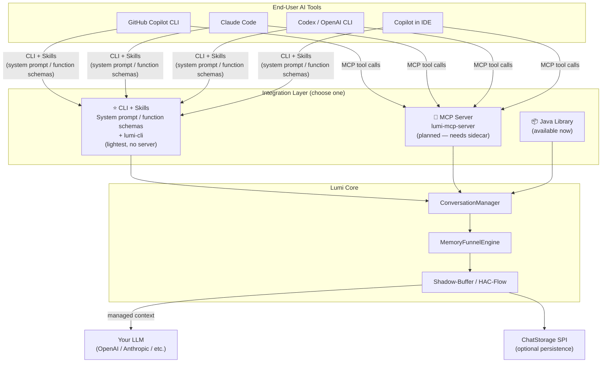
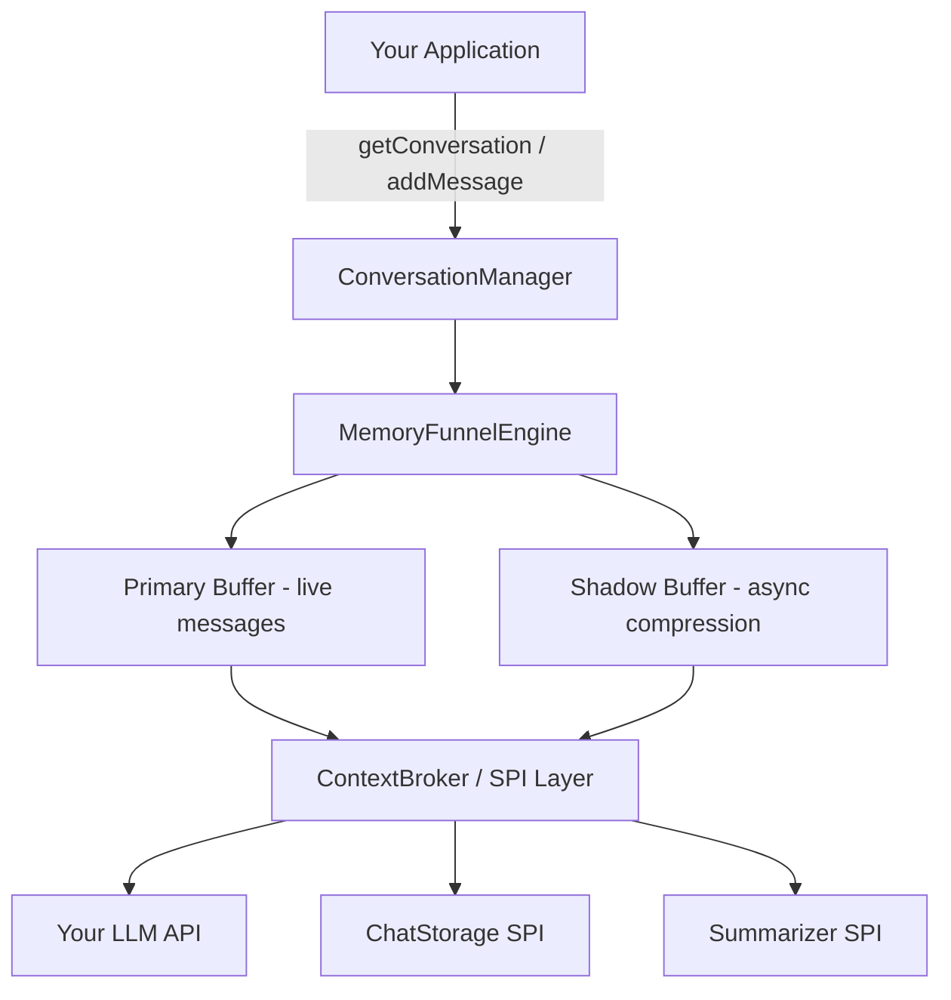

# Lumi Conversation Manager

[](releases)
[](actions)
[](LICENSE)
[](https://openjdk.org/)
[](README.md)

A thread-safe, pluggable Java library for managing LLM conversation state — automatic token budgeting, smart compression, and task-aware context eviction.

---

## Table of Contents

1. [Why Lumi?](#why-lumi)
2. [Key Features](#key-features)
3. [Architecture Overview](#architecture-overview)
4. [Quick Start](#quick-start)
5. [SPI Customization](#spi-customization)
6. [Integration Paths](#integration-paths)
7. [Project Structure](#project-structure)
8. [Documentation](#documentation)
9. [Contributing](#contributing)
10. [License](#license)

---

## 🤔 Why Lumi?

**The problem:**

- LLM context windows fill up fast in long or multi-turn conversations
- Naïve full-history replay wastes tokens and drives up API costs
- Rolling windows silently drop earlier context — losing important task history
- No standard Java library handles conversation state management well

**How Lumi solves it:**

Lumi's **Shadow-Buffer architecture** decouples live message writes from compression work. A lock-free primary buffer holds the active conversation while a background shadow buffer runs the **HAC-Flow algorithm** — hierarchical async compression that summarizes completed tasks and enforces your token budget, all without blocking the calling thread. The result: `addMessage()` is always fast, context is always within budget, and no important history is ever silently dropped.

---

## ✨ Key Features

| Feature | Description |
|---|---|
| 🔒 Lock-free concurrent writes | Primary buffer uses non-blocking structures — safe under high concurrency |
| 🧠 Shadow-Buffer async compression | `addMessage()` never blocks; compression runs in the background |
| 🎯 Task-aware eviction | Completed tasks are summarized and evicted, preserving task boundaries |
| 🔄 Delta-patch rollback | `DeltaPatcher` records diffs so you can roll back to any prior state |
| 🔌 Pluggable SPI layer | Swap in any LLM, storage backend, or retention policy via clean SPIs |
| 📦 Zero runtime dependencies | Core modules ship with no mandatory third-party libraries |
| 🏗️ Framework-agnostic | Works in any Java app — Spring, Quarkus, plain Java, or CLI |

---

## 🏛️ Architecture Overview

### Where Lumi fits in the ecosystem



> **Note:** CLI + Skills (no server) is the lightest AI-native path — available once `lumi-cli` ships. MCP Server is planned for tools that support MCP natively. Direct Java library usage is available today.

### Lumi's internal components



- **`MemoryFunnelEngine`** — orchestrates buffer lifecycle and HAC-Flow compression passes
- **`SessionContext`** — holds per-session state: messages, token counts, task boundaries
- **`ContextBroker`** — SPI orchestrator; routes to storage, summarizer, sanitizer, and metrics
- **`DeltaPatcher`** — records deltas on every mutation; enables point-in-time rollback
- **`TaskTracker`** — tracks active tasks; triggers eviction when a task is marked complete

---

## 🚀 Quick Start

### Add the dependency

**Gradle (build.gradle.kts):**
```kotlin
dependencies {
    implementation("com.lumi:conversation-manager:1.0.0")
}
```

**Maven (pom.xml):**
```xml
<dependency>
  <groupId>com.lumi</groupId>
  <artifactId>conversation-manager</artifactId>
  <version>1.0.0</version>
</dependency>
```

### Basic usage

`ConversationManager` is a **factory** — one instance handles all your users' conversations. Call `getConversation(id)` to create or retrieve a `Conversation` handle, then operate on it directly.

```java
// 1. Build once — share as a singleton across your application
ConversationManager manager = ConversationManager.builder()
    .tokenBudget(4096)
    .summarizer(new OpenAiSummarizer(openAiClient))  // your LLM for compression
    .storage(new JdbcChatStorage(dataSource))         // optional: persist conversations
    .sanitizer(new PiiSanitizer())                    // optional: strip PII
    .build();

// 2. Get or create a Conversation handle — auto-created on first call
Conversation conv = manager.getConversation("user-42");

// 3. Add messages directly on the Conversation — chainable
conv.addMessage(ChatMessage.text("user", "Help me refactor this Java class."))
    .addMessage(ChatMessage.text("assistant", "Sure! Here is the refactored version..."));

// 4. Pass managed context to your LLM — always within token budget
String llmResponse = openAiClient.chat(conv.messages());

// 5. When a task is done — Lumi summarizes and evicts it to free token budget
conv.markTaskComplete("refactor-task");

// Each session is fully independent — concurrent users never contend
Conversation alice = manager.getConversation("user-alice");
Conversation bob   = manager.getConversation("user-bob");
```

---

## 🔌 SPI Customization

All behaviour is replaceable via the SPI layer in `interface/`. Implement any interface and register it via the builder.

**Example: custom `Summarizer`**

```java
public class MyOpenAiSummarizer implements Summarizer {

    private final OpenAiClient client;

    public MyOpenAiSummarizer(OpenAiClient client) {
        this.client = client;
    }

    @Override
    public String summarize(List<ChatMessage> messages) {
        String prompt = "Summarize this conversation segment concisely:\n"
            + messages.stream().map(m -> m.role() + ": " + m.content())
                      .collect(Collectors.joining("\n"));
        return client.complete(prompt);
    }
}

// Register it when building the manager — one manager, all sessions
ConversationManager manager = ConversationManager.builder()
    .summarizer(new MyOpenAiSummarizer(openAiClient))
    .tokenBudget(8192)
    .build();
```

**Available SPI interfaces:** `ChatStorage`, `TokenCounter`, `RetentionPolicy`, `Summarizer`, `Sanitizer`, `Encryptor`, `MetricsProvider`, `ExecutorFactory`

---

## 🔗 Integration Paths

**How LLM tool calling works** (important context before choosing a path):

When an LLM "calls a skill", it doesn't execute anything directly. The flow is always:
1. LLM outputs: *"I want to call `store_message` with sessionId=X, role=user, content=Y"*
2. The **host** (your application, Claude Code, an agent framework) intercepts the tool call
3. Host executes the backing action (CLI command, library call, etc.)
4. Result is returned to the LLM as the tool result
5. LLM continues reasoning with the updated context

So there are always **two things to configure on the LLM side**: (a) skill definitions so the LLM knows what tools exist, and (b) the host must have a tool-execution loop that actually runs them. Lumi minimises both.

---

### 📦 Java Library — Available Now

Embed Lumi directly in any JVM application. Best for: building your own AI assistant, chatbot, or agent framework in Java.

```java
ConversationManager manager = ConversationManager.builder()
    .tokenBudget(4096)
    .summarizer(new OpenAiSummarizer(client))
    .build();

Conversation conv = manager.getConversation(sessionId);
conv.addMessage(ChatMessage.text("user", userInput));
String response = llmClient.chat(conv.messages());
conv.addMessage(ChatMessage.text("assistant", response));
```

---

### 🖥️ CLI + Skills — Planned ⭐ Lightest AI-Native Path

> **Status: Planned.** No server required. Just `lumi-cli` installed — the AI tool handles execution.

This is the lightest "AI-native" integration. Lumi ships **skill definitions** (system prompt snippets + function schemas) that tell an LLM how to call `lumi-cli` commands. The host AI tool — which already has a bash/shell execution capability (e.g., Claude Code's bash tool, agent frameworks) — runs the CLI. No MCP server, no extra process.

**What Lumi provides out of the box:**
- `lumi-skills.md` — system prompt snippet describing Lumi skills (for chat-based tools)
- `lumi-skills-openai.json` — function schemas for OpenAI-compatible API calls
- `lumi-skills-anthropic.json` — tool_use schemas for Anthropic API calls

**How the LLM uses it (end-to-end example):**
```
1. User asks: "Help me refactor this class"

2. LLM calls store_message skill:
   → host runs: lumi msg add session-1 --role user --content "Help me refactor..."
   ← lumi returns: { "sessionId": "session-1", "tokenCount": 120, "messages": [...] }

3. LLM calls get_context skill:
   → host runs: lumi context get session-1
   ← lumi returns: managed message list (compressed, within token budget)

4. LLM sends context to LLM API → generates response

5. LLM calls store_message again with assistant reply:
   → host runs: lumi msg add session-1 --role assistant --content "Here is..."
```

**What needs to be configured on the LLM/host side:**
| If using... | Configuration needed |
|---|---|
| Claude Code (has bash tool) | Add `lumi-skills.md` to system prompt; install `lumi-cli` |
| OpenAI API (custom agent) | Register `lumi-skills-openai.json` as tools in API call; write tool-execution loop that runs CLI |
| Anthropic API (custom agent) | Register `lumi-skills-anthropic.json`; write tool-execution loop |
| LangChain / other framework | Wrap lumi-cli calls as LangChain tools; load skill definitions |

**Skills included:**

| Skill | CLI backing | Description |
|---|---|---|
| `store_message` | `lumi msg add` | Add a user or assistant turn |
| `get_context` | `lumi context get` | Get managed context (token-budgeted) |
| `mark_task_complete` | `lumi task complete` | Signal task done → evict context |
| `rollback` | `lumi rollback` | Roll back to prior state |
| `create_checkpoint` | `lumi checkpoint save` | Snapshot session |
| `restore_checkpoint` | `lumi checkpoint restore` | Restore snapshot |

---

### 🔌 MCP Server — Planned

> **Status: Planned.** Requires `lumi-mcp-server` running as a sidecar. Useful when the AI tool supports MCP natively and you don't want to write a tool-execution loop.

MCP-compatible hosts (Claude Code, GitHub Copilot, Cursor) handle the tool-execution loop automatically. The trade-off vs. CLI+Skills: one extra process to start, but zero code on the host side.

```json
{
  "mcpServers": {
    "lumi": {
      "command": "java",
      "args": ["-jar", "lumi-mcp-server.jar"],
      "env": { "LUMI_SESSION_DIR": "${workspaceFolder}/.lumi" }
    }
  }
}
```

Compatible hosts: Claude Code, GitHub Copilot (VS Code), Cursor, Claude Desktop.

---

### 🤖 Google A2A — Future

**A2A (Agent-to-Agent Protocol)** is Google's standard for multi-agent collaboration — complementary to MCP (MCP = agent-to-tool; A2A = agent-to-agent). Relevant for future multi-agent Lumi scenarios. Tracked in [brainstorms.md](tmp/brainstorms.md).

---

## 📁 Project Structure

```
lumi-conversation-manager/
├─ brain/                   # MemoryFunnelEngine, SessionContext, TaskTracker (open source)
│   ├─ engine/
│   └─ memory/
├─ interface/               # SPI contracts: Summarizer, ChatStorage, TokenCounter … (open source)
├─ examples/                # Runnable demos: OpenAI, Claude, in-memory (open source)
├─ docs/                    # White paper, HLD, DDD design docs
├─ modules/
│   ├─ official/            # Signed binary modules — no PRs accepted
│   └─ sandbox/             # Community modules for experimentation
└─ tmp/                     # Temporary working files (not tracked in git)
```

---

## 📚 Documentation

| Document | Description |
|---|---|
| [White Paper](docs/whitepaper.md) | Problem statement, HAC-Flow algorithm, stakeholder value |
| [High-Level Design](docs/hld.md) | Architecture, Shadow-Buffer design, SPI framework |
| [Domain Design (DDD)](docs/ddd.md) | Java class design, SPI contracts, test standards |
| [Implementation Plan](tmp/implementation_plan.md) | Phase-by-phase build roadmap |

---

## 🤝 Contributing

PRs are welcome for: **`brain/`**, **`interface/`**, **`examples/`**, **`docs/`**, **`modules/sandbox/`**

`modules/official/` contains signed binary modules and is not open to PRs.

See [Agents.MD](Agents.MD) for coding conventions, SPI design guidelines, and the contribution workflow.

---

## 📄 License

MIT © [Jeff Li](https://github.com/zheli001)
