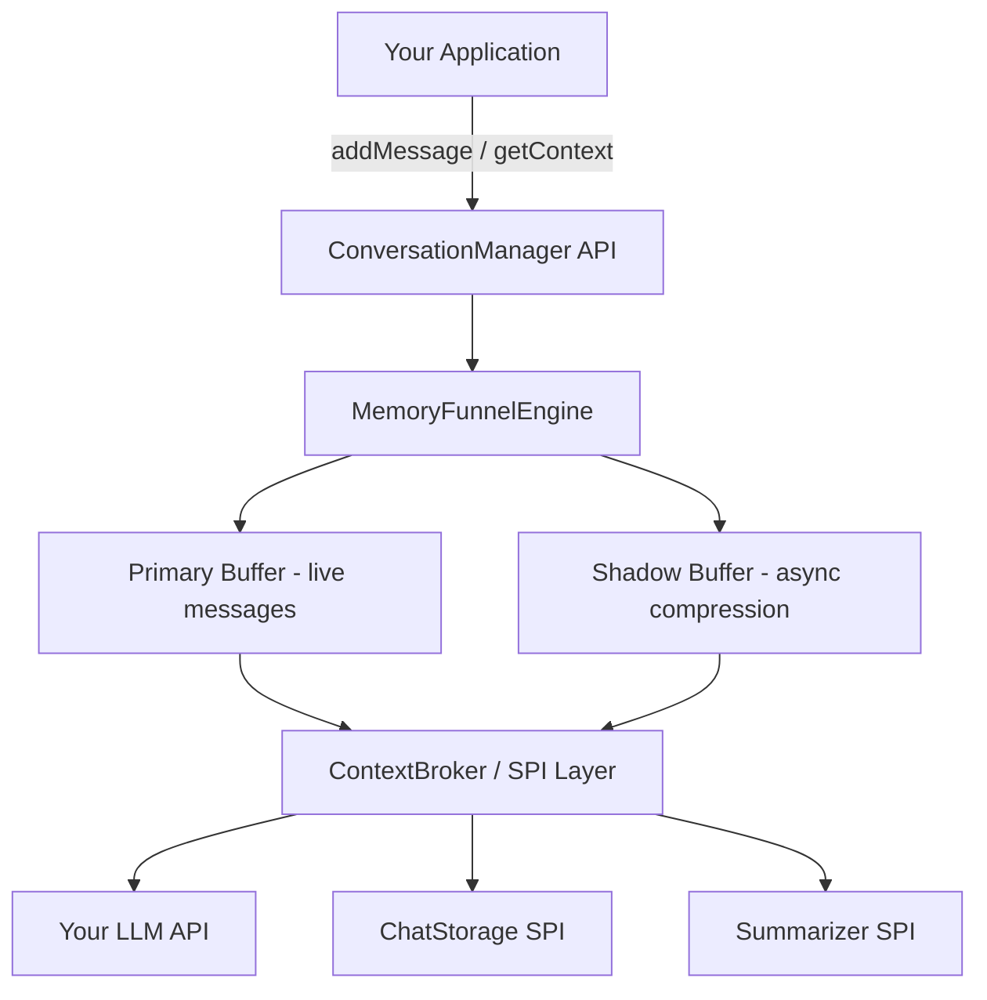

# Lumi Conversation Manager

[](releases)
[](actions)
[](LICENSE)
[](https://openjdk.org/)
[](README.md)

A thread-safe, pluggable Java library for managing LLM conversation state — automatic token budgeting, smart compression, and task-aware context eviction.

---

## Table of Contents

1. [Why Lumi?](#why-lumi)
2. [Key Features](#key-features)
3. [Architecture Overview](#architecture-overview)
4. [Quick Start](#quick-start)
5. [SPI Customization](#spi-customization)
6. [Integration Paths](#integration-paths)
7. [Project Structure](#project-structure)
8. [Documentation](#documentation)
9. [Contributing](#contributing)
10. [License](#license)

---

## 🤔 Why Lumi?

**The problem:**

- LLM context windows fill up fast in long or multi-turn conversations
- Naïve full-history replay wastes tokens and drives up API costs
- Rolling windows silently drop earlier context — losing important task history
- No standard Java library handles conversation state management well

**How Lumi solves it:**

Lumi's **Shadow-Buffer architecture** decouples live message writes from compression work. A lock-free primary buffer holds the active conversation while a background shadow buffer runs the **HAC-Flow algorithm** — hierarchical async compression that summarizes completed tasks and enforces your token budget, all without blocking the calling thread. The result: `addMessage()` is always fast, context is always within budget, and no important history is ever silently dropped.

---

## ✨ Key Features

| Feature | Description |
|---|---|
| 🔒 Lock-free concurrent writes | Primary buffer uses non-blocking structures — safe under high concurrency |
| 🧠 Shadow-Buffer async compression | `addMessage()` never blocks; compression runs in the background |
| 🎯 Task-aware eviction | Completed tasks are summarized and evicted, preserving task boundaries |
| 🔄 Delta-patch rollback | `DeltaPatcher` records diffs so you can roll back to any prior state |
| 🔌 Pluggable SPI layer | Swap in any LLM, storage backend, or retention policy via clean SPIs |
| 📦 Zero runtime dependencies | Core modules ship with no mandatory third-party libraries |
| 🏗️ Framework-agnostic | Works in any Java app — Spring, Quarkus, plain Java, or CLI |

---

## 🏛️ Architecture Overview



**Core components:**

- **`MemoryFunnelEngine`** — orchestrates buffer lifecycle and HAC-Flow compression passes
- **`SessionContext`** — holds per-session state: messages, token counts, task boundaries
- **`ContextBroker`** — SPI orchestrator; routes to storage, summarizer, sanitizer, and metrics
- **`DeltaPatcher`** — records deltas on every mutation; enables point-in-time rollback
- **`TaskTracker`** — tracks active tasks; triggers eviction when a task is marked complete

---

## 🚀 Quick Start

### Add the dependency

**Gradle (build.gradle.kts):**
```kotlin
dependencies {
    implementation("com.lumi:conversation-manager:1.0.0")
}
```

**Maven (pom.xml):**
```xml
<dependency>
  <groupId>com.lumi</groupId>
  <artifactId>conversation-manager</artifactId>
  <version>1.0.0</version>
</dependency>
```

### Basic usage

```java
// 1. Implement the Summarizer SPI for your LLM provider
Summarizer summarizer = messages -> {
    // Call your LLM API (OpenAI, Claude, etc.)
    return openAiClient.summarize(messages);
};

// 2. Build the ConversationManager
ConversationManager manager = ConversationManager.builder()
    .tokenBudget(4096)
    .summarizer(summarizer)
    .storage(new InMemoryStorage())      // or RedisStorage, JdbcStorage
    .sanitizer(new PiiSanitizer())       // optional: strip PII before storage
    .build();

// 3. Use it in your application
manager.addMessage(Role.USER, "Help me refactor this Java class.");
manager.addMessage(Role.ASSISTANT, "Sure! Here is the refactored version...");

// When a task is complete, mark it — Lumi will summarize and evict it
manager.markTaskComplete("refactor-task");

// Get the current context to send to your LLM (always within token budget)
List<ChatMessage> context = manager.getContext();
String llmResponse = openAiClient.chat(context);
```

---

## 🔌 SPI Customization

All behaviour is replaceable via the SPI layer in `interface/`. Implement any interface and register it via the builder.

**Example: custom `Summarizer`**

```java
public class MyOpenAiSummarizer implements Summarizer {

    private final OpenAiClient client;

    public MyOpenAiSummarizer(OpenAiClient client) {
        this.client = client;
    }

    @Override
    public String summarize(List<ChatMessage> messages) {
        String prompt = "Summarize this conversation segment concisely:\n"
            + messages.stream().map(m -> m.role() + ": " + m.content())
                      .collect(Collectors.joining("\n"));
        return client.complete(prompt);
    }
}

// Register it when building the manager
ConversationManager manager = ConversationManager.builder()
    .summarizer(new MyOpenAiSummarizer(openAiClient))
    .build();
```

**Available SPI interfaces:** `ChatStorage`, `TokenCounter`, `RetentionPolicy`, `Summarizer`, `Sanitizer`, `Encryptor`, `MetricsProvider`, `ExecutorFactory`

---

## 🔗 Integration Paths

- **Java Library** — add the Gradle or Maven dependency shown above; zero configuration required beyond your SPIs
- **MCP Server** — run `lumi-mcp-server.jar` as a sidecar process; Claude Code and GitHub Copilot connect automatically via the Model Context Protocol
- **CLI** — script conversation workflows with `lumi session create`, `lumi msg add`, `lumi context get`

---

## 📁 Project Structure

```
lumi-conversation-manager/
├─ brain/                   # MemoryFunnelEngine, SessionContext, TaskTracker (open source)
│   ├─ engine/
│   └─ memory/
├─ interface/               # SPI contracts: Summarizer, ChatStorage, TokenCounter … (open source)
├─ examples/                # Runnable demos: OpenAI, Claude, in-memory (open source)
├─ docs/                    # White paper, HLD, DDD design docs
├─ modules/
│   ├─ official/            # Signed binary modules — no PRs accepted
│   └─ sandbox/             # Community modules for experimentation
└─ tmp/                     # Temporary working files (not tracked in git)
```

---

## 📚 Documentation

| Document | Description |
|---|---|
| [White Paper](docs/whitepaper.md) | Problem statement, HAC-Flow algorithm, stakeholder value |
| [High-Level Design](docs/hld.md) | Architecture, Shadow-Buffer design, SPI framework |
| [Domain Design (DDD)](docs/ddd.md) | Java class design, SPI contracts, test standards |
| [Evaluation Plan](docs/evaluation_plan.md) | HAC-Flow-based evaluation methodology, benchmarks, and success criteria |
| [Comparison Results](docs/comparison_results.md) | Multi-dimensional comparison with LangChain4j, Spring AI, LangChain, and Semantic Kernel |
| [Implementation Plan](tmp/implementation_plan.md) | Phase-by-phase build roadmap |

---

## 🤝 Contributing

PRs are welcome for: **`brain/`**, **`interface/`**, **`examples/`**, **`docs/`**, **`modules/sandbox/`**

`modules/official/` contains signed binary modules and is not open to PRs.

See [Agents.MD](Agents.MD) for coding conventions, SPI design guidelines, and the contribution workflow.

---

## 📄 License

MIT © [Jeff Li](https://github.com/zheli001)
