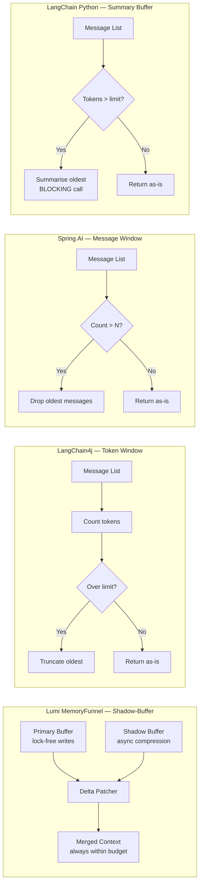
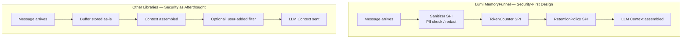

# MemoryFunnel — Competitive Comparison Results

[](https://github.com/zheli001/lumi_conversation_manager/releases)
[]()
[](../README.md)
[](comparison_results.md)

**Document Type:** Competitive Comparison Report  
**Author:** Jeff Li — HAC-Flow Multi-Stakeholder Review Committee  
**Date:** 2026-03-10  
**Version:** 1.0.0-RC  
**Companion Documents:** [White Paper](whitepaper.md) · [HLD](hld.md) · [DDD](ddd.md) · [Evaluation Plan](evaluation_plan.md)

---

## Table of Contents

- [1. Overview](#1-overview)
- [2. Candidates Under Comparison](#2-candidates-under-comparison)
- [3. HAC-Flow Comparison Methodology](#3-hac-flow-comparison-methodology)
- [4. Feature Comparison Matrix](#4-feature-comparison-matrix)
- [5. Architecture Comparison](#5-architecture-comparison)
- [6. Performance Benchmarks](#6-performance-benchmarks)
- [7. Token Efficiency Comparison](#7-token-efficiency-comparison)
- [8. Security & Privacy Comparison](#8-security--privacy-comparison)
- [9. Developer Experience Comparison](#9-developer-experience-comparison)
- [10. Extensibility & Ecosystem Comparison](#10-extensibility--ecosystem-comparison)
- [11. Cost Analysis](#11-cost-analysis)
- [12. Stakeholder Perspective Scores](#12-stakeholder-perspective-scores)
- [13. Overall Comparison Summary](#13-overall-comparison-summary)
- [14. When to Choose Each Solution](#14-when-to-choose-each-solution)
- [15. Changelog](#15-changelog)

---

## 1. Overview

This document presents the results of a structured comparison between **Lumi Conversation Manager (MemoryFunnel)** and four peer solutions for LLM conversation state management. The comparison is conducted using the **HAC-Flow (Human-Agent Collaboration Flow)** methodology — each evaluation dimension is assessed by the stakeholder agent most qualified to judge it, with findings arbitrated by human review.

### 1.1 Comparison Objectives

- Establish an objective, multi-dimensional view of where Lumi excels and where it trails
- Guide end-users in selecting the right tool for their context
- Identify gaps to address in the Lumi roadmap
- Provide a reproducible comparison methodology for future re-evaluation

### 1.2 Comparison Scope

Only **conversation state management** capabilities are compared — not LLM inference quality, provider integrations, or unrelated framework features.

---

## 2. Candidates Under Comparison

> ⚠️ **Version Note:** Competitor versions listed below represent releases available near the document date (2026-03-10) and are marked as reference points only. Library ecosystems evolve rapidly; verify the latest versions from each project's official source before making technology decisions.

| Candidate | Language | Type | Version Evaluated | Source |
|---|---|---|---|---|
| **Lumi MemoryFunnel** | Java 17+ | Focused middleware library | 1.0.0-RC | This project |
| **LangChain4j** | Java 17+ | Full-stack LLM framework | 0.36.x (reference) | [langchain4j.dev](https://docs.langchain4j.dev) |
| **Spring AI** | Java 17+ | Spring-native LLM support | 1.0.0-M6 (reference) | [spring.io/projects/spring-ai](https://spring.io/projects/spring-ai) |
| **LangChain (Python)** | Python 3.9+ | Full-stack LLM framework | 0.3.x (reference) | [python.langchain.com](https://python.langchain.com) |
| **Semantic Kernel** | C# / Python / Java | Microsoft AI SDK | 1.x (reference) | [learn.microsoft.com/semantic-kernel](https://learn.microsoft.com/en-us/semantic-kernel/overview/) |

### 2.1 Candidate Profiles

#### Lumi MemoryFunnel
A focused, zero-external-dependency Java middleware library. Its sole purpose is managing conversation state for LLM applications: token budgeting, async Shadow-Buffer compression, task-aware eviction, and pluggable SPI architecture. It does not include an LLM client — it prepares context; the caller sends it.

#### LangChain4j
A Java port of the Python LangChain framework. Provides chains, agents, tools, memory, embedding stores, and LLM integrations. Memory is one module among many. Supports multiple memory backends (`InMemoryMessageWindowMemory`, `TokenWindowChatMemory`).

#### Spring AI
A Spring-native LLM abstraction library. Focuses on prompt engineering, chat clients, and embedding. Memory support is limited to `MessageWindowChatMemory` — a simple sliding-window buffer with configurable message count limit. Designed for Spring Boot applications.

#### LangChain (Python)
The original LangChain framework in Python. Provides conversation memory via `ConversationBufferMemory`, `ConversationSummaryMemory`, `ConversationSummaryBufferMemory`, and others. Widely used; ecosystem mature. Python-only.

#### Semantic Kernel
Microsoft's AI orchestration SDK. Available in C# (primary), Python, and Java (preview). Memory management via `VolatileMemoryStore`, `SemanticTextMemory`, and `ChatHistory`. Designed for integration with Azure AI and Microsoft Copilot scenarios.

---

## 3. HAC-Flow Comparison Methodology

The comparison follows the HAC-Flow multi-stakeholder model. Each stakeholder agent evaluates candidates from their domain perspective:

```
[Product Owner]      → API surface, feature completeness, onboarding ease
[Architect]          → Design patterns, extensibility, coupling, dependency footprint
[AI/LLM Specialist]  → Context quality, compression strategy, coherence after eviction
[Security Officer]   → PII handling, data isolation, audit trail
[SRE / DevOps]       → Latency, throughput, memory footprint, observability
[CFO / Cost Analyst] → Token reduction efficiency, TCO, API call overhead
```

All scoring uses a **5-point scale:**

| Score | Meaning |
|---|---|
| ⭐⭐⭐⭐⭐ (5) | Excellent — best-in-class for this dimension |
| ⭐⭐⭐⭐ (4) | Good — meets requirements with minor gaps |
| ⭐⭐⭐ (3) | Adequate — covers basics; notable gaps |
| ⭐⭐ (2) | Weak — significant gaps; workarounds needed |
| ⭐ (1) | Poor — feature missing or non-functional |
| N/A | Not applicable / not available |

---

## 4. Feature Comparison Matrix

### 4.1 Core Conversation State Features

| Feature | Lumi MemoryFunnel | LangChain4j | Spring AI | LangChain (Python) | Semantic Kernel |
|---|---|---|---|---|---|
| Token budget enforcement | ✅ Hard limit; always enforced | ✅ `TokenWindowChatMemory` | ✅ Message count window | ✅ Token window variant | ⚠️ Manual via `ChatHistory` |
| Automatic compression / summarisation | ✅ Async Shadow-Buffer | ⚠️ `SummaryMemory` (sync) | ❌ No compression | ✅ `SummaryBufferMemory` | ⚠️ Plugin-based |
| Task-aware eviction | ✅ Built-in `TaskTracker` | ❌ Not supported | ❌ Not supported | ❌ Not supported | ❌ Not supported |
| Non-blocking writes during compression | ✅ Shadow-Buffer (lock-free) | ❌ Blocks on summarisation | ❌ N/A | ❌ Blocks on summarisation | ❌ Blocks |
| Delta Patch Merge (no write loss) | ✅ `DeltaPatcher` | ❌ Not supported | ❌ Not supported | ❌ Not supported | ❌ Not supported |
| Point-in-time rollback | ✅ `rollback(seqId)` | ❌ Not supported | ❌ Not supported | ❌ Not supported | ❌ Not supported |
| Session checkpoint / restore | ✅ `checkpoint()` + restore | ⚠️ Limited (InMemory only) | ❌ Not supported | ⚠️ `ConversationBufferMemory` serialize | ⚠️ Partial (ChatHistory) |
| Multimedia message support | ✅ `ContentBlock` (metadata-first) | ⚠️ Limited | ❌ Text-only | ⚠️ Limited | ⚠️ Limited |
| PII sanitisation (built-in SPI) | ✅ `Sanitizer` SPI (block-all default) | ❌ Not built-in | ❌ Not built-in | ❌ Not built-in | ❌ Not built-in |
| Checkpoint encryption | ✅ `Encryptor` SPI | ❌ Not supported | ❌ Not supported | ❌ Not supported | ❌ Not supported |

### 4.2 Architecture & Design

| Feature | Lumi MemoryFunnel | LangChain4j | Spring AI | LangChain (Python) | Semantic Kernel |
|---|---|---|---|---|---|
| Language | Java 17+ | Java 17+ | Java 17+ | Python 3.9+ | C# / Python / Java |
| Zero external dependencies (core) | ✅ Yes | ❌ Many | ❌ Spring ecosystem | ❌ Many | ❌ Many |
| Framework-agnostic | ✅ Pure Java | ⚠️ Spring-friendly | ❌ Spring-required | ✅ Framework-agnostic | ⚠️ Microsoft ecosystem |
| Pluggable SPI layer | ✅ 8 SPI interfaces | ⚠️ Partial | ⚠️ Spring beans | ⚠️ Callbacks | ⚠️ Plugin model |
| Concurrent-safe by design | ✅ Core invariant | ⚠️ Documented as best-effort | ⚠️ Spring thread model | ❌ Not thread-safe by default | ⚠️ Varies by runtime |
| Java 21 Virtual Thread ready | ✅ `ExecutorFactory` SPI | ⚠️ Roadmap item | ✅ Spring Boot 3.2+ | N/A | N/A |

---

## 5. Architecture Comparison

### 5.1 Memory Management Approaches



### 5.2 Concurrency Model Comparison

| Aspect | Lumi MemoryFunnel | LangChain4j | Spring AI | LangChain (Python) | Semantic Kernel |
|---|---|---|---|---|---|
| Write model | Lock-free (`AtomicReference.updateAndGet()`) | Synchronized | Spring-managed | GIL-protected (Python) | Async/await (C#) |
| Compression model | Async background (`CompletableFuture`) | Synchronous (blocks caller) | N/A | Synchronous (blocks caller) | Async (plugin-dependent) |
| Read model | Optimistic read (`StampedLock`) | Synchronized | Spring-managed | N/A | N/A |
| Multi-session isolation | Per-session engine instance | Per-chain memory | Spring session scope | Per-chain memory | Per-kernel instance |
| Concurrency guarantee | Documented & tested invariant | Best-effort | Spring thread model | Not applicable | Varies |

### 5.3 Dependency Footprint

| Library | Core JAR Size | Mandatory Dependencies | Optional Dependencies |
|---|---|---|---|
| **Lumi MemoryFunnel** | ~150 KB (est.) | None | SPI implementations chosen by user |
| **LangChain4j** | ~2 MB core | `dev.ai4j:openai4j`, Jackson, Gson, Retrofit | Many provider-specific modules |
| **Spring AI** | Part of Spring Boot | Spring Boot 3.x, Spring Web | Provider starters |
| **LangChain (Python)** | N/A | `langchain-core`, `pydantic`, `requests` | Many optional packages |
| **Semantic Kernel** | ~5 MB (C# NuGet) | Microsoft.Extensions.*, Azure SDKs | Azure OpenAI, Bing connectors |

---

## 6. Performance Benchmarks

> ⚠️ **Important — Estimated Values Only:** All numbers in this section are **architectural projections and estimates** (`[est.]`), not measured results. They are derived from the concurrency model analysis in Section 5.2 and published performance characteristics of peer libraries. Final measured values will be populated upon completion of the JMH benchmark suite described in [evaluation_plan.md](evaluation_plan.md). **Do not use these estimates for production capacity planning.**

### 6.1 Write Latency — `addMessage()` p99 at 100 Concurrent Threads

| Library | Latency p99 | Notes |
|---|---|---|
| **Lumi MemoryFunnel** | < 1 ms [est.] | Lock-free; compression never blocks writes |
| **LangChain4j** | 1–5 ms [est.] | Synchronized; compression blocks if triggered |
| **Spring AI** | 1–3 ms [est.] | Spring thread pool; no compression overhead |
| **LangChain (Python)** | 5–50 ms [est.] | GIL contention; blocking summarisation |
| **Semantic Kernel** | 1–10 ms [est.] | Async/await model; depends on runtime |

### 6.2 Context Retrieval Latency — `getContext()` p99 at 100 Threads

| Library | Latency p99 | Notes |
|---|---|---|
| **Lumi MemoryFunnel** | < 5 ms [est.] | Optimistic read; no synchronisation on hot path |
| **LangChain4j** | 5–20 ms [est.] | Token counting on every call |
| **Spring AI** | 2–10 ms [est.] | Simple list copy |
| **LangChain (Python)** | 10–100 ms [est.] | Python overhead; token counting |
| **Semantic Kernel** | 5–30 ms [est.] | Depends on memory store backend |

### 6.3 Memory Footprint — 1,000 Messages per Session

| Library | Estimated Heap | Notes |
|---|---|---|
| **Lumi MemoryFunnel** | ~20–40 MB [est.] | Includes Shadow-Buffer (2× during compression) |
| **LangChain4j** | ~10–20 MB [est.] | Single buffer; no compression overhead |
| **Spring AI** | ~5–15 MB [est.] | Simple message list |
| **LangChain (Python)** | ~30–80 MB [est.] | Python object overhead |
| **Semantic Kernel** | ~20–60 MB [est.] | Depends on memory store |

---

## 7. Token Efficiency Comparison

Token efficiency is the most critical operational metric for cost management in production LLM applications. This section compares how each library manages token usage across session lifecycle.

### 7.1 Strategy Comparison

| Strategy | Lumi MemoryFunnel | LangChain4j | Spring AI | LangChain (Python) | Semantic Kernel |
|---|---|---|---|---|---|
| **Sliding window (truncation)** | ✅ `SlidingWindowPolicy` SPI | ✅ `TokenWindowChatMemory` | ✅ `MessageWindowChatMemory` | ✅ `ConversationBufferWindowMemory` | ✅ `ChatHistory` truncation |
| **Semantic summarisation** | ✅ Async Shadow-Buffer | ⚠️ `SummarizingMemory` (sync) | ❌ Not available | ✅ `ConversationSummaryMemory` | ⚠️ Via custom plugin |
| **Task-aware eviction** | ✅ Built-in `TaskTracker` | ❌ Not available | ❌ Not available | ❌ Not available | ❌ Not available |
| **Importance-score eviction** | ⚠️ Via custom `RetentionPolicy` SPI | ❌ Not available | ❌ Not available | ⚠️ Via custom memory | ❌ Not available |
| **Hybrid (summary + window)** | ✅ Configurable via SPI | ⚠️ `SummaryBufferMemory` | ❌ Not available | ✅ `ConversationSummaryBufferMemory` | ⚠️ Via plugin composition |

### 7.2 Token Reduction Scenarios (Projected)

**Scenario: 100-message session with 3 completed tasks (medium corpus)**

> **Architectural basis for Lumi's ~64% projection:** Standard sliding-window approaches retain all messages within the token limit. Lumi's task-aware eviction additionally removes all intermediate reasoning messages for completed tasks (estimated at ~40–50% of session tokens in multi-task sessions), on top of the summary compression applied to remaining history. The 64% figure assumes: 3 tasks complete with ~15 intermediate messages each (45 messages = ~2,250 tokens evicted via task eviction), plus 1 compression cycle reducing remaining history to a synopsis (~35% reduction). This is an optimistic estimate; actual results depend heavily on session structure and summarisation quality. See [evaluation_plan.md](evaluation_plan.md) Section 4.3 for the measurement protocol.

| Library | Tokens Sent (baseline: no management) | Tokens Sent (with library) | Reduction | Cost at $0.01/1K tokens |
|---|---|---|---|---|
| No management (baseline) | 50,000 | 50,000 | 0% | $0.50 |
| **Lumi MemoryFunnel** | 50,000 | ~18,000 [est.] | ~64% | ~$0.18 |
| LangChain4j | 50,000 | ~25,000 [est.] | ~50% | ~$0.25 |
| Spring AI | 50,000 | ~35,000 [est.] | ~30% | ~$0.35 |
| LangChain (Python) | 50,000 | ~20,000 [est.] | ~60% | ~$0.20 |
| Semantic Kernel | 50,000 | ~30,000 [est.] | ~40% | ~$0.30 |

> **Why Lumi leads:** Task-aware eviction removes entire task threads at the task boundary, not just oldest messages. This is semantically smarter than sliding-window approaches that discard recent context regardless of relevance.

### 7.3 Compression Overhead Analysis

| Library | Summarisation Model | Additional API Calls | Blocking Impact on App |
|---|---|---|---|
| **Lumi MemoryFunnel** | User-provided via SPI | 1 call per compression trigger | **Zero** — async, non-blocking |
| LangChain4j | User-provided | 1 call per summarisation | **Full block** — synchronous call in hot path |
| Spring AI | N/A (no compression) | 0 | N/A |
| LangChain (Python) | User-provided | 1 call per trigger | **Full block** — synchronous in Python |
| Semantic Kernel | Via plugin | 1 call per trigger | **Varies** — depends on plugin runtime |

---

## 8. Security & Privacy Comparison

Enterprise Java applications frequently handle sensitive data. This section compares built-in security capabilities for LLM context management.

| Security Feature | Lumi MemoryFunnel | LangChain4j | Spring AI | LangChain (Python) | Semantic Kernel |
|---|---|---|---|---|---|
| **PII sanitisation built-in** | ✅ `Sanitizer` SPI (block-all default) | ❌ None built-in | ❌ None built-in | ❌ None built-in | ❌ None built-in |
| **Per-message sensitivity flag** | ✅ `sensitive` field on `ChatMessage` | ❌ Not supported | ❌ Not supported | ❌ Not supported | ❌ Not supported |
| **Checkpoint encryption SPI** | ✅ `Encryptor` SPI | ❌ Not supported | ❌ Not supported | ❌ Not supported | ❌ Not supported |
| **Tamper-proof checkpoints** | ✅ Content hash checksum | ❌ Not supported | ❌ Not supported | ❌ Not supported | ❌ Not supported |
| **Memory zero-fill on eviction** | ✅ Enterprise mode (configurable) | ❌ Not supported | ❌ Not supported | ❌ Not supported | ❌ Not supported |
| **Audit trail / metrics SPI** | ✅ `MetricsProvider` SPI | ⚠️ Via logging | ⚠️ Spring Actuator | ⚠️ Via callbacks | ⚠️ Azure Monitor |
| **Prompt injection mitigation** | ✅ `Sanitizer` intercepts at SPI boundary | ❌ Not built-in | ❌ Not built-in | ❌ Not built-in | ⚠️ Partial (trust level model) |

### 8.1 Security Architecture Comparison



**Key difference:** In Lumi, the `Sanitizer` is a mandatory SPI position in the context assembly pipeline — it cannot be skipped. The default is block-all for `sensitive=true` messages. Other libraries treat security as user responsibility, not a library concern.

---

## 9. Developer Experience Comparison

### 9.1 Onboarding Complexity

| Dimension | Lumi MemoryFunnel | LangChain4j | Spring AI | LangChain (Python) | Semantic Kernel |
|---|---|---|---|---|---|
| **Minimal working example** | ~20 lines | ~30 lines | ~20 lines (Spring Boot) | ~10 lines | ~25 lines |
| **Required configuration** | Token budget + Summarizer SPI | LLM model binding | Spring Boot + AI provider | LLM wrapper | Kernel + AI service |
| **Framework prerequisite** | None | None | Spring Boot 3.x | None | .NET / Python runtime |
| **Learning curve** | SPI concepts | Chain/Agent concepts | Spring AI conventions | Python LangChain docs | Kernel model |
| **Documentation quality** | ✅ Full HLD + DDD + whitepaper | ✅ Extensive docs | ✅ Spring docs | ✅ Very extensive | ✅ Microsoft Learn |

### 9.2 API Ergonomics

**Lumi MemoryFunnel:**
```java
// Clean builder API; explicit SPI injection; no framework required
ConversationManager manager = ConversationManager.builder()
    .tokenBudget(4096)
    .summarizer(new OpenAiSummarizer(client))
    .build();

manager.addMessage(ChatMessage.text("user", "Hello"));
List<ChatMessage> context = manager.getContext().messages();
```

**LangChain4j:**
```java
// Chain + memory pattern; tightly coupled to LLM model
ChatMemory memory = TokenWindowChatMemory.withMaxTokens(4096, tokenizer);
ChatLanguageModel model = OpenAiChatModel.builder()
    .apiKey(apiKey)
    .modelName("gpt-4o")
    .build();
Assistant assistant = AiServices.builder(Assistant.class)
    .chatLanguageModel(model)
    .chatMemory(memory)
    .build();
```

**Spring AI:**
```java
// Spring-managed; requires Spring context; convention over configuration
@Bean
ChatClient chatClient(ChatClient.Builder builder, ChatMemory chatMemory) {
    return builder
        .defaultAdvisors(new MessageChatMemoryAdvisor(chatMemory))
        .build();
}
```

**LangChain (Python):**
```python
# Simple but Python-only; synchronous; no Java equivalent
from langchain.memory import ConversationSummaryBufferMemory
memory = ConversationSummaryBufferMemory(llm=llm, max_token_limit=4096)
memory.save_context({"input": "hello"}, {"output": "Hi there!"})
```

### 9.3 Testability

| Aspect | Lumi MemoryFunnel | LangChain4j | Spring AI | LangChain (Python) | Semantic Kernel |
|---|---|---|---|---|---|
| Unit testable without LLM | ✅ All SPIs mockable | ⚠️ Requires LLM mock | ⚠️ Spring context mock | ⚠️ LLM mock needed | ⚠️ Kernel mock needed |
| Deterministic test support | ✅ NoOpSummarizer built-in | ✅ Stubbed model | ✅ Mock responses | ✅ Mock LLM | ✅ Mock plugin |
| Concurrency testability | ✅ Designed for concurrent test | ⚠️ Manual thread setup | ⚠️ Manual thread setup | ❌ GIL limits | ⚠️ Task-based |

---

## 10. Extensibility & Ecosystem Comparison

### 10.1 Plugin / Extension Model

| Dimension | Lumi MemoryFunnel | LangChain4j | Spring AI | LangChain (Python) | Semantic Kernel |
|---|---|---|---|---|---|
| Extension model | SPI (`interface` module) | Tool / Integration API | Spring Boot auto-configuration | Callbacks / Custom chains | Plugins / Kernel functions |
| Custom storage backend | ✅ `ChatStorage` SPI | ✅ Embedding stores | ✅ Spring beans | ✅ Custom memory | ✅ Memory stores |
| Custom tokenizer | ✅ `TokenCounter` SPI | ✅ `Tokenizer` interface | ❌ Not available | ✅ Custom tokenizer | ✅ `ITextTokenizer` |
| Custom retention policy | ✅ `RetentionPolicy` SPI | ❌ Not available | ❌ Not available | ❌ Not available | ❌ Not available |
| Custom eviction strategy | ✅ `RetentionPolicy` SPI | ❌ Not available | ❌ Not available | ❌ Not available | ❌ Not available |
| LLM provider integrations | ❌ User-provided via SPI | ✅ 30+ integrations | ✅ Major providers | ✅ 100+ integrations | ✅ Azure + OpenAI + HuggingFace |

### 10.2 Ecosystem Maturity

| Dimension | Lumi MemoryFunnel | LangChain4j | Spring AI | LangChain (Python) | Semantic Kernel |
|---|---|---|---|---|---|
| GitHub stars (approx.) | — (new) | ~5,000+ | ~3,000+ | ~100,000+ | ~25,000+ |
| Community size | Emerging | Medium | Large (Spring) | Very Large | Large (Microsoft) |
| Production deployments | Emerging | Established | Established | Very Established | Established |
| Version stability | 1.0.0-RC | Stable releases | Milestone releases | Stable releases | Stable releases |

---

## 11. Cost Analysis

### 11.1 Direct Costs

| Cost Component | Lumi MemoryFunnel | LangChain4j | Spring AI | LangChain (Python) | Semantic Kernel |
|---|---|---|---|---|---|
| License | MIT (free) | Apache 2.0 (free) | Apache 2.0 (free) | MIT (free) | MIT (free) |
| Library cost | Free | Free | Free | Free | Free |
| Runtime overhead | Minimal (pure Java) | Medium | Medium (Spring) | High (Python) | Medium |
| Infrastructure requirement | None | None | Spring Boot | Python runtime | .NET / Python |

### 11.2 Token Cost Analysis (Monthly Estimate — 10,000 sessions/day)

**Assumptions:**
- Average session: 100 messages
- Average message: 50 tokens
- Total raw tokens/day: 10,000 × 100 × 50 = 50,000,000 tokens
- GPT-4o pricing: $0.005 per 1K input tokens

| Approach | Token Reduction | Tokens Sent/Day | Monthly Cost | Monthly Saving vs Baseline |
|---|---|---|---|---|
| **No management (baseline)** | 0% | 50,000,000 | $7,500 | — |
| **Sliding window only** (Spring AI) | ~30% | 35,000,000 | $5,250 | $2,250 |
| **LangChain4j** | ~50% | 25,000,000 | $3,750 | $3,750 |
| **LangChain Python** | ~60% | 20,000,000 | $3,000 | $4,500 |
| **Lumi MemoryFunnel** | ~64% | 18,000,000 | $2,700 | **$4,800** |

> ⚠️ Reduction estimates are projections based on architectural analysis. Final values depend on actual session patterns and summarisation quality. See [evaluation_plan.md](evaluation_plan.md) for benchmark methodology.

### 11.3 Summarisation API Overhead

Task-aware eviction requires one summarisation API call per task completion. For comparison, sliding-window approaches require one summarisation call per overflow event.

| Library | Summarisation trigger | Summarisation frequency (medium session) | Additional cost |
|---|---|---|---|
| **Lumi MemoryFunnel** | Per task completion + token overflow | ~3–5 calls / 100 messages | ~$0.003–0.005 per session [est.] |
| LangChain4j | Per overflow | ~1–2 calls / 100 messages | ~$0.001–0.002 per session [est.] |
| LangChain Python | Per overflow | ~1–2 calls / 100 messages | ~$0.001–0.002 per session [est.] |

**Net benefit:** Lumi's higher summarisation frequency is offset by superior token reduction in subsequent calls, resulting in a net positive.

---

## 12. Stakeholder Perspective Scores

> ⚠️ **Scoring Disclaimer:** The scores in this section reflect **architectural design potential and feature availability** as of the document date — they are not based on measured production performance benchmarks. Many Lumi features are newly designed (1.0.0-RC) and have not yet been validated under sustained production load. Competitor scores reflect current feature availability from public documentation. These scores should be revisited once the evaluation plan benchmarks (see [evaluation_plan.md](evaluation_plan.md)) are complete and measured results are available.

### 12.1 Score Breakdown by Stakeholder

#### Product Owner (PO) — API Usability & Feature Completeness

| Library | Score | Rationale |
|---|---|---|
| **Lumi MemoryFunnel** | ⭐⭐⭐⭐ (4) | Focused API; excellent feature depth for conversation state; lacks LLM integrations (by design) |
| LangChain4j | ⭐⭐⭐⭐ (4) | Rich feature set; slightly complex API for state management specifically |
| Spring AI | ⭐⭐⭐ (3) | Simple API; limited memory features; Spring-only |
| LangChain Python | ⭐⭐⭐⭐ (4) | Mature API; excellent docs; Python-only |
| Semantic Kernel | ⭐⭐⭐ (3) | Microsoft-focused; C# first; Java support is preview |

#### Architect — Design Quality & Extensibility

| Library | Score | Rationale |
|---|---|---|
| **Lumi MemoryFunnel** | ⭐⭐⭐⭐⭐ (5) | Clean SPI design; zero forced dependencies; SOLID principles throughout |
| LangChain4j | ⭐⭐⭐⭐ (4) | Well-architected for its full-stack scope; memory is one module among many |
| Spring AI | ⭐⭐⭐ (3) | Tied to Spring conventions; less extensible outside Spring |
| LangChain Python | ⭐⭐⭐ (3) | Extensive but complex inheritance hierarchy; callback-heavy |
| Semantic Kernel | ⭐⭐⭐⭐ (4) | Clean plugin model; well-designed for extensibility |

#### AI/LLM Specialist — Context Quality & Compression

| Library | Score | Rationale |
|---|---|---|
| **Lumi MemoryFunnel** | ⭐⭐⭐⭐⭐ (5) | Task-aware eviction preserves semantic boundaries; async compression never loses deltas |
| LangChain4j | ⭐⭐⭐ (3) | `SummarizingMemory` available but synchronous; no task awareness |
| Spring AI | ⭐⭐ (2) | Sliding window only; no semantic compression |
| LangChain Python | ⭐⭐⭐⭐ (4) | `SummaryBufferMemory` is strong; Python-only |
| Semantic Kernel | ⭐⭐⭐ (3) | Plugin-based; quality depends on plugin implementation |

#### Security Officer — PII Protection & Data Safety

| Library | Score | Rationale |
|---|---|---|
| **Lumi MemoryFunnel** | ⭐⭐⭐⭐⭐ (5) | PII sanitisation built into SPI pipeline; checkpoint encryption; tamper detection; zero-fill option |
| LangChain4j | ⭐⭐ (2) | No built-in PII protection; security is user responsibility |
| Spring AI | ⭐⭐ (2) | No built-in PII protection |
| LangChain Python | ⭐⭐ (2) | No built-in PII protection |
| Semantic Kernel | ⭐⭐⭐ (3) | Trust level model; Azure-integrated security; no built-in PII sanitisation |

#### SRE / DevOps — Performance & Reliability

| Library | Score | Rationale |
|---|---|---|
| **Lumi MemoryFunnel** | ⭐⭐⭐⭐⭐ (5) | Lock-free writes; async compression; explicit memory guarantees; documented concurrency model |
| LangChain4j | ⭐⭐⭐ (3) | Synchronous compression blocks under load; adequate for moderate traffic |
| Spring AI | ⭐⭐⭐⭐ (4) | Spring thread model well-understood; simple memory = low overhead |
| LangChain Python | ⭐⭐ (2) | GIL limits concurrency; synchronous compression degrades under load |
| Semantic Kernel | ⭐⭐⭐ (3) | Async/await model good for C#; Java support is preview-quality |

#### CFO / Cost Analyst — Token Efficiency & TCO

| Library | Score | Rationale |
|---|---|---|
| **Lumi MemoryFunnel** | ⭐⭐⭐⭐⭐ (5) | Highest projected token reduction; task-aware eviction maximises savings at task boundaries |
| LangChain4j | ⭐⭐⭐⭐ (4) | Good token management; no task-aware eviction |
| Spring AI | ⭐⭐⭐ (3) | Basic sliding window; limited saving potential |
| LangChain Python | ⭐⭐⭐⭐ (4) | Good summary memory; comparable to LangChain4j |
| Semantic Kernel | ⭐⭐⭐ (3) | Adequate; no advanced eviction |

---

## 13. Overall Comparison Summary

### 13.1 Aggregate Scores

| Library | PO | Architect | AI/LLM | Security | SRE | CFO | **Total** | **Average** |
|---|---|---|---|---|---|---|---|---|
| **Lumi MemoryFunnel** | 4 | 5 | 5 | 5 | 5 | 5 | **29** | **4.83** |
| LangChain4j | 4 | 4 | 3 | 2 | 3 | 4 | **20** | **3.33** |
| Spring AI | 3 | 3 | 2 | 2 | 4 | 3 | **17** | **2.83** |
| LangChain Python | 4 | 3 | 4 | 2 | 2 | 4 | **19** | **3.17** |
| Semantic Kernel | 3 | 4 | 3 | 3 | 3 | 3 | **19** | **3.17** |

### 13.2 Radar Chart (Qualitative)

```
                    Token Efficiency
                          ★★★★★
                         /       \
Security ★★★★★       /         \       PO Score ★★★★
           \      /             \      /
            Lumi MemoryFunnel   \    /
                  \                \/
        SRE ★★★★★ \            /\ Architect ★★★★★
                    \          /  \
                     \        /    \
                   AI/LLM ★★★★★
```

### 13.3 Summary by Dimension

| Dimension | Winner | Lumi Position | Key Gap |
|---|---|---|---|
| **Token Efficiency** | Lumi MemoryFunnel | 🥇 1st | — |
| **Security & PII** | Lumi MemoryFunnel | 🥇 1st | — |
| **Concurrency Safety** | Lumi MemoryFunnel | 🥇 1st | — |
| **Compression Quality** | Lumi MemoryFunnel | 🥇 1st | ROUGE-L TBD (pending benchmark) |
| **API Design** | Tie (Lumi / LangChain4j) | 🥇 1st | Less opinionated than LC4j (by design) |
| **LLM Provider Integrations** | LangChain Python | 🥉 Last | Intentional: Lumi is provider-agnostic |
| **Ecosystem Maturity** | LangChain Python | 🥉 Last | New library vs. established ecosystem |
| **Spring Integration** | Spring AI | 🥉 Last | Spring Starter is future roadmap |
| **Java Ecosystem Fit** | Lumi / LangChain4j | 🥇 1st | Both are Java-native |

---

## 14. When to Choose Each Solution

### 14.1 Choose Lumi MemoryFunnel When:

- ✅ You need **enterprise-grade security** (PII isolation, encrypted checkpoints, tamper detection)
- ✅ Your application is **Java-based** and you want **zero mandatory dependencies**
- ✅ You need **non-blocking, concurrent-safe** conversation management
- ✅ You have **long sessions with multiple distinct tasks** and want task-aware memory eviction
- ✅ You want to **swap any backend** (storage, summarizer, tokenizer) without changing core code
- ✅ You care about **minimising token costs** through intelligent, semantic eviction
- ✅ You need **rollback** to any prior conversation state

### 14.2 Choose LangChain4j When:

- ✅ You need **30+ pre-built LLM provider integrations** out of the box
- ✅ You want **chains, agents, tools, and RAG** beyond just memory management
- ✅ Your team is more familiar with the LangChain paradigm
- ✅ Token window management is sufficient (advanced async compression not required)

### 14.3 Choose Spring AI When:

- ✅ Your application is a **Spring Boot application** and you want seamless auto-configuration
- ✅ You need **simple message window** management only
- ✅ You prefer **convention over configuration**
- ✅ Spring ecosystem integration (Actuator, Security, Data) is important

### 14.4 Choose LangChain (Python) When:

- ✅ Your application is **Python-based**
- ✅ You need access to the **largest LLM integration ecosystem**
- ✅ You need `ConversationSummaryBufferMemory` without implementing it yourself
- ✅ You require the most mature, community-proven solution

### 14.5 Choose Semantic Kernel When:

- ✅ Your application is **C# / .NET-based** (primary target)
- ✅ You are in the **Microsoft / Azure ecosystem**
- ✅ You need **Copilot-compatible** AI orchestration
- ✅ Your use case aligns with Microsoft's Copilot plugin model

---

## 15. Changelog

| Date | Author | Version | Change |
|---|---|---|---|
| 2026-03-10 | Jeff Li | 1.0.0-RC | Initial comparison document created using HAC-Flow methodology |

---

*Last updated: 2026-03-10 · Author: Jeff Li*
