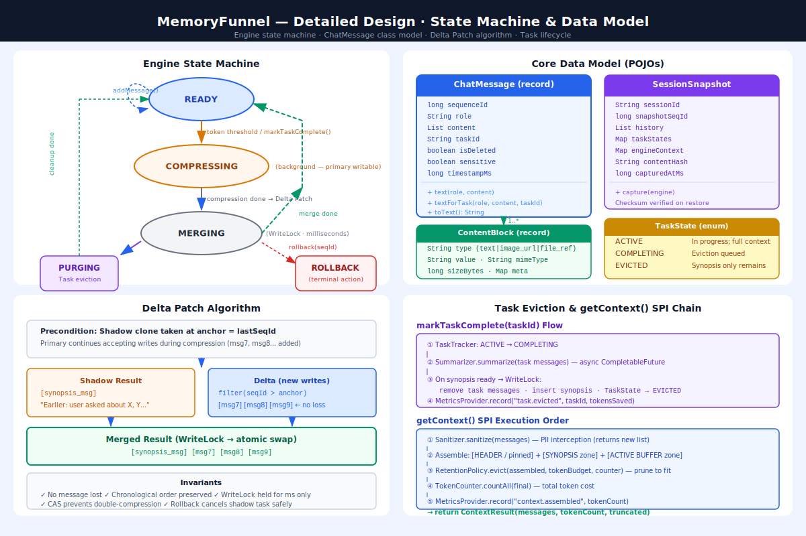

# MemoryFunnel — Detailed Design Document (DDD)

**Document Type:** Detailed Design Document (DDD)  
**Version:** 1.0.0-RC  
**Companion Documents:** [PRD / White Paper](whitepaper.md) · [High Level Design](hld.md)



---

## Table of Contents
- [1. Data Model Design](#1-data-model-design)
- [2. SPI Interface Specifications](#2-spi-interface-specifications)
- [3. Core Engine — MemoryFunnelEngine](#3-core-engine--memoryfunnelengine)
- [4. Shadow-Buffer Implementation — SessionContext](#4-shadow-buffer-implementation--sessioncontext)
- [5. Delta Patch Algorithm — DeltaPatcher](#5-delta-patch-algorithm--deltapatcher)
- [6. Task Tracker](#6-task-tracker)
- [7. Context Broker](#7-context-broker)
- [8. Default SPI Implementations](#8-default-spi-implementations)
- [9. Multimedia Content Handling](#9-multimedia-content-handling)
- [10. Session Checkpoint & Recovery](#10-session-checkpoint--recovery)
- [11. Rollback Mechanism](#11-rollback-mechanism)
- [12. Builder & Configuration API](#12-builder--configuration-api)
- [13. Error Handling Matrix](#13-error-handling-matrix)
- [14. Concurrency Edge Cases & Mitigations](#14-concurrency-edge-cases--mitigations)
- [15. Unit Test Coverage Standards](#15-unit-test-coverage-standards)

---

## 1. Data Model Design

### 1.1 ChatMessage — Core POJO

```java
package com.lumi.conversation.model;

import java.io.Serializable;
import java.util.List;

/**
 * Immutable unit of conversation history.
 * Sequence IDs are monotonically increasing; gaps indicate evicted messages.
 */
public record ChatMessage(
    long sequenceId,              // Monotonic; assigned by engine (never by caller)
    String role,                  // "system" | "user" | "assistant" | "tool"
    List<ContentBlock> content,   // Supports text and multimedia references
    String taskId,                // Nullable; associates message to a task lifecycle
    boolean isDeleted,            // Soft-delete flag (for eviction; GC'd before getContext())
    boolean sensitive,            // If true, Sanitizer MUST redact before LLM send
    long timestampMs              // Wall-clock time of addMessage() call
) implements Serializable {

    /** Convenience constructor for simple text messages */
    public static ChatMessage text(String role, String content) {
        return new ChatMessage(
            -1L,              // sequenceId assigned by engine
            role,
            List.of(ContentBlock.text(content)),
            null, false, false,
            System.currentTimeMillis()
        );
    }

    /** Convenience: text message with task association */
    public static ChatMessage textForTask(String role, String content, String taskId) {
        return new ChatMessage(-1L, role, List.of(ContentBlock.text(content)),
            taskId, false, false, System.currentTimeMillis());
    }

    /** Returns flattened text representation for token counting */
    public String toText() {
        return content.stream()
            .filter(b -> "text".equals(b.type()))
            .map(ContentBlock::value)
            .reduce("", (a, b) -> a + "\n" + b)
            .strip();
    }
}
```

### 1.2 ContentBlock — Multimedia Metadata Container

```java
package com.lumi.conversation.model;

import java.io.Serializable;
import java.util.Map;

/**
 * Represents a single content unit within a ChatMessage.
 * Binary data is NEVER stored — only references and metadata.
 */
public record ContentBlock(
    String type,                    // "text" | "image_url" | "file_ref" | "audio_ref"
    String value,                   // Text content OR URI/path reference for media
    String mimeType,                // Nullable for text; e.g. "image/png", "application/pdf"
    long sizeBytes,                 // Approximate size; -1 if unknown
    Map<String, String> meta        // sha256 checksum, alt-text, etc.
) implements Serializable {

    public static ContentBlock text(String text) {
        return new ContentBlock("text", text, null, -1, Map.of());
    }

    public static ContentBlock imageUrl(String url, String altText) {
        return new ContentBlock("image_url", url, "image/*", -1,
            Map.of("alt_text", altText));
    }

    public static ContentBlock fileRef(String path, String mimeType, long sizeBytes, String sha256) {
        return new ContentBlock("file_ref", path, mimeType, sizeBytes,
            Map.of("sha256", sha256));
    }

    public boolean isMedia() {
        return !"text".equals(type);
    }
}
```

### 1.3 TaskState — Task Lifecycle Enum

```java
package com.lumi.conversation.model;

public enum TaskState {
    ACTIVE,       // Task is in progress; messages are part of active context
    COMPLETING,   // markTaskComplete() called; compression/eviction queued
    EVICTED       // Intermediate messages removed; only synopsis remains
}
```

### 1.4 SessionSnapshot — Checkpoint POJO

```java
package com.lumi.conversation.model;

import java.io.Serializable;
import java.util.List;
import java.util.Map;

/**
 * Full serialisable state of a conversation session.
 * Must be verified via checksum before restoration.
 */
public class SessionSnapshot implements Serializable {
    private final String sessionId;
    private final long snapshotSeqId;          // sequenceId at time of capture
    private final List<ChatMessage> history;
    private final Map<String, TaskState> taskStates;
    private final Map<String, Object> engineContext; // engine config parameters
    private final String contentHash;               // SHA-256 of serialised history; verified on load
    private final long capturedAtMs;

    // Constructor, getters omitted for brevity; use @lombok or generate

    /**
     * Factory method — captures current engine state atomically under read lock.
     * @throws SnapshotException if engine is mid-merge (MERGING state); caller should retry
     */
    public static SessionSnapshot capture(MemoryFunnelEngine engine) {
        return engine.captureSnapshot();
    }

    public String getContentHash() { return contentHash; }
    // ... other getters
}
```

---

## 2. SPI Interface Specifications

### 2.1 ChatStorage

```java
package com.lumi.conversation.spi;

import com.lumi.conversation.model.ChatMessage;
import com.lumi.conversation.model.SessionSnapshot;
import java.util.List;

/** Persistent storage for conversation history. Must be thread-safe. */
public interface ChatStorage {

    /** Append a single message. Implementations must be atomic. */
    void append(String sessionId, ChatMessage message);

    /** Replace the full message list (used after Delta Patch merge). */
    void replaceAll(String sessionId, List<ChatMessage> messages);

    /** Load all messages for a session (for engine bootstrap). */
    List<ChatMessage> loadAll(String sessionId);

    /** Persist an encrypted/serialised snapshot blob. */
    void saveSnapshot(String sessionId, byte[] snapshotBytes);

    /** Load snapshot blob for restoration. Returns null if none exists. */
    byte[] loadSnapshot(String sessionId);

    /** Delete all data for a session (GDPR right-to-erasure). */
    void deleteSession(String sessionId);
}
```

### 2.2 TokenCounter

```java
package com.lumi.conversation.spi;

import com.lumi.conversation.model.ChatMessage;
import java.util.List;

/** Estimates token count for LLM API billing/limit purposes. Pure function; stateless. */
public interface TokenCounter {

    /** Count tokens for a single string. */
    int count(String text);

    /** Count tokens for all messages combined. */
    default int countAll(List<ChatMessage> messages) {
        return messages.stream()
            .mapToInt(m -> count(m.toText()))
            .sum();
    }
}
```

### 2.3 RetentionPolicy

```java
package com.lumi.conversation.spi;

import com.lumi.conversation.model.ChatMessage;
import java.util.List;

/** Decides when to compress and how to evict messages. Stateless; returns decisions. */
public interface RetentionPolicy {

    /** Returns true if compression should be triggered given the current token count. */
    boolean shouldCompress(String sessionId, int currentTokenCount, int maxTokenBudget);

    /**
     * Given the full message list, return a pruned list that fits within the token budget.
     * Implementation must always preserve: system messages, pinned messages, most recent N messages.
     */
    List<ChatMessage> evict(List<ChatMessage> messages, int tokenBudget, TokenCounter counter);

    /** Returns messages that should be pinned (always included in context, never evicted). */
    default List<ChatMessage> getPinned(List<ChatMessage> messages) {
        return messages.stream()
            .filter(m -> "system".equals(m.role()))
            .toList();
    }
}
```

### 2.4 Summarizer

```java
package com.lumi.conversation.spi;

import com.lumi.conversation.model.ChatMessage;
import java.util.List;
import java.util.concurrent.CompletableFuture;

/**
 * Compresses a list of messages into a semantic synopsis.
 * Implementation typically calls an LLM API — must be async.
 */
public interface Summarizer {

    /**
     * Produces a condensed synopsis of the provided messages.
     * The synopsis replaces the original messages in the context window.
     * @return CompletableFuture completing with synopsis text (single string)
     */
    CompletableFuture<String> summarize(List<ChatMessage> messages);
}
```

### 2.5 Sanitizer

```java
package com.lumi.conversation.spi;

import com.lumi.conversation.model.ChatMessage;
import java.util.List;

/**
 * Intercepts messages BEFORE they leave the library towards the LLM.
 * Must return a NEW list — never mutate input messages (records are immutable).
 * Thread-safe; may be called concurrently.
 */
public interface Sanitizer {

    /**
     * Returns sanitised copies of messages.
     * Messages with sensitive=true MUST be handled (redacted, omitted, or explicitly passed through).
     */
    List<ChatMessage> sanitize(List<ChatMessage> messages);
}
```

### 2.6 Encryptor

```java
package com.lumi.conversation.spi;

/** Provides symmetric encryption for checkpoint persistence. */
public interface Encryptor {
    byte[] encrypt(byte[] plaintext);
    byte[] decrypt(byte[] ciphertext);
}
```

### 2.7 MetricsProvider

```java
package com.lumi.conversation.spi;

import java.util.Map;

/**
 * Fire-and-forget metrics emission. Implementations MUST NOT throw.
 * Wrapped in try-catch by engine; exceptions are swallowed.
 */
public interface MetricsProvider {
    void record(String eventName, double value, Map<String, String> tags);

    default void record(String eventName, double value) {
        record(eventName, value, Map.of());
    }
}
```

---

## 3. Core Engine — MemoryFunnelEngine

```java
package com.lumi.conversation.engine;

public class MemoryFunnelEngine {

    private final SessionContext sessionContext;
    private final ContextBroker broker;
    private final TaskTracker taskTracker;
    private final AtomicLong sequenceCounter = new AtomicLong(0);
    private final AtomicReference<EngineState> state = new AtomicReference<>(EngineState.READY);

    public enum EngineState { READY, COMPRESSING, MERGING, PURGING }

    /** Main write path. Lock-free on the hot path. */
    public void addMessage(ChatMessage rawMsg) {
        long seq = sequenceCounter.getAndIncrement();
        // Records are immutable; reconstruct with assigned sequenceId
        ChatMessage msg = new ChatMessage(seq, rawMsg.role(), rawMsg.content(),
            rawMsg.taskId(), false, rawMsg.sensitive(), rawMsg.timestampMs());

        sessionContext.addToPrimary(msg);
        taskTracker.register(msg.taskId(), seq);

        broker.getMetrics().record("memory_funnel.message.added", 1,
            Map.of("sessionId", sessionId, "role", msg.role()));

        // Async threshold check — never blocks addMessage()
        broker.checkAndTriggerCompression(sessionContext, state);
    }

    /** Read path — assembles context for LLM. */
    public CompletableFuture<ContextResult> getContext() {
        return CompletableFuture.supplyAsync(() -> {
            List<ChatMessage> messages = sessionContext.readPrimary();
            List<ChatMessage> sanitised = broker.getSanitizer().sanitize(messages);
            List<ChatMessage> evicted = broker.getRetentionPolicy().evict(
                sanitised, config.getMaxTokenBudget(), broker.getTokenCounter());
            int tokenCount = broker.getTokenCounter().countAll(evicted);

            broker.getMetrics().record("memory_funnel.context.assembled", tokenCount,
                Map.of("sessionId", sessionId));

            return new ContextResult(evicted, tokenCount,
                evicted.size() < sanitised.size());
        }, executor);
    }

    /** Mark a task complete → trigger task-based eviction. */
    public CompletableFuture<Void> markTaskComplete(String taskId) {
        return CompletableFuture.runAsync(() -> {
            taskTracker.transition(taskId, TaskState.COMPLETING);
            List<ChatMessage> taskMessages = sessionContext.getMessagesByTaskId(taskId);
            broker.getSummarizer().summarize(taskMessages).thenAccept(synopsis -> {
                sessionContext.evictTask(taskId, synopsis, sequenceCounter.getAndIncrement());
                taskTracker.transition(taskId, TaskState.EVICTED);
                broker.getMetrics().record("memory_funnel.task.evicted", 1,
                    Map.of("taskId", taskId));
            });
        }, executor);
    }

    /** Rollback to a sequence anchor — discards all messages after seqId. */
    public void rollback(long anchorSeqId) {
        // Cancel any running shadow compression first
        sessionContext.cancelShadowTask();
        // Truncate primary under write lock
        sessionContext.truncateAfter(anchorSeqId);
        state.set(EngineState.READY);
    }

    /** Export full session state as a serialisable POJO. */
    public SessionSnapshot captureSnapshot() {
        return sessionContext.captureSnapshot(sessionId, taskTracker.getStates());
    }
}
```

---

## 4. Shadow-Buffer Implementation — SessionContext

```java
package com.lumi.conversation.engine;

public class SessionContext {

    private final AtomicReference<List<ChatMessage>> primaryBuffer =
        new AtomicReference<>(new ArrayList<>());
    private final StampedLock lock = new StampedLock();
    private volatile Future<?> shadowTask = null;

    // ── Write path (lock-free) ─────────────────────────────────────────────
    public void addToPrimary(ChatMessage msg) {
        primaryBuffer.updateAndGet(list -> {
            List<ChatMessage> next = new ArrayList<>(list);
            next.add(msg);
            return Collections.unmodifiableList(next);
        });
    }

    // ── Read path (optimistic) ─────────────────────────────────────────────
    public List<ChatMessage> readPrimary() {
        long stamp = lock.tryOptimisticRead();
        List<ChatMessage> snapshot = primaryBuffer.get();
        if (!lock.validate(stamp)) {
            // Optimistic read invalidated — fall back to shared read lock
            stamp = lock.readLock();
            try { snapshot = primaryBuffer.get(); }
            finally { lock.unlockRead(stamp); }
        }
        return snapshot;
    }

    // ── Shadow task management ─────────────────────────────────────────────
    public long beginShadow() {
        // Returns the sequenceId anchor at the moment of snapshot
        List<ChatMessage> snapshot = readPrimary();
        long anchor = snapshot.isEmpty() ? -1 : snapshot.get(snapshot.size() - 1).sequenceId();
        // Shadow compression runs on a copy of the snapshot
        // The actual compression is submitted to executor by ContextBroker
        return anchor;
    }

    public void cancelShadowTask() {
        if (shadowTask != null && !shadowTask.isDone()) {
            shadowTask.cancel(true);
            shadowTask = null;
        }
    }

    // ── Delta Patch merge (write lock — brief) ─────────────────────────────
    public void applyShadowMerge(List<ChatMessage> compressedMessages, long anchorSeqId) {
        long stamp = lock.writeLock();
        try {
            List<ChatMessage> current = primaryBuffer.get();
            List<ChatMessage> delta = current.stream()
                .filter(m -> m.sequenceId() > anchorSeqId)
                .toList();

            List<ChatMessage> merged = new ArrayList<>(compressedMessages);
            merged.addAll(delta);
            primaryBuffer.set(Collections.unmodifiableList(merged));
        } finally {
            lock.unlockWrite(stamp);
        }
    }

    // ── Task eviction (write lock) ─────────────────────────────────────────
    public void evictTask(String taskId, String synopsis, long synopsisSeqId) {
        long stamp = lock.writeLock();
        try {
            List<ChatMessage> current = primaryBuffer.get();
            // Build synopsis as a synthetic message
            ChatMessage synopsisMsg = new ChatMessage(
                synopsisSeqId, "system",
                List.of(ContentBlock.text("[Task Summary: " + taskId + "] " + synopsis)),
                taskId, false, false, System.currentTimeMillis()
            );
            List<ChatMessage> result = new ArrayList<>();
            result.add(synopsisMsg);
            current.stream()
                .filter(m -> !taskId.equals(m.taskId()) || m.isDeleted())
                .forEach(result::add);
            primaryBuffer.set(Collections.unmodifiableList(result));
        } finally {
            lock.unlockWrite(stamp);
        }
    }

    // ── Rollback ───────────────────────────────────────────────────────────
    public void truncateAfter(long anchorSeqId) {
        long stamp = lock.writeLock();
        try {
            List<ChatMessage> current = primaryBuffer.get();
            List<ChatMessage> truncated = current.stream()
                .filter(m -> m.sequenceId() <= anchorSeqId)
                .toList();
            primaryBuffer.set(Collections.unmodifiableList(truncated));
        } finally {
            lock.unlockWrite(stamp);
        }
    }

    // ── Snapshot capture (read lock) ───────────────────────────────────────
    public SessionSnapshot captureSnapshot(String sessionId, Map<String, TaskState> taskStates) {
        long stamp = lock.readLock();
        try {
            List<ChatMessage> history = new ArrayList<>(primaryBuffer.get());
            long lastSeq = history.isEmpty() ? -1 : history.get(history.size() - 1).sequenceId();
            String hash = computeHash(history);
            return new SessionSnapshot(sessionId, lastSeq, history, taskStates,
                Map.of(), hash, System.currentTimeMillis());
        } finally {
            lock.unlockRead(stamp);
        }
    }

    private String computeHash(List<ChatMessage> messages) {
        // SHA-256 of serialised message list
        // Implementation uses MessageDigest; omitted for brevity
        return "sha256:" + Integer.toHexString(messages.hashCode());
    }
}
```

---

## 5. Delta Patch Algorithm — DeltaPatcher

```
Algorithm: DeltaPatch(compressedMessages, anchorSeqId, currentPrimary)
────────────────────────────────────────────────────────────────────────
Input:
  compressedMessages: List<ChatMessage>  ← output of Summarizer
  anchorSeqId: long                      ← last sequenceId when shadow clone was taken
  currentPrimary: List<ChatMessage>      ← current state of primaryBuffer

Step 1: Extract delta
  delta ← { msg ∈ currentPrimary | msg.sequenceId > anchorSeqId }
  
  INVARIANT: delta contains ONLY messages added while compression was running
  INVARIANT: delta is ordered by sequenceId (monotonic guarantee)

Step 2: Merge
  merged ← compressedMessages + delta
  
  NOTE: System/pinned messages from compressedMessages appear first
  NOTE: New active messages from delta append after compressed history
  NOTE: No deduplication needed — sequenceId gap between compressed range 
        and delta is guaranteed by anchorSeqId anchor

Step 3: Validate (before atomic swap)
  ASSERT: merged.last.sequenceId == currentPrimary.last.sequenceId
  ASSERT: merged.size <= currentPrimary.size  (compression should reduce count)

Step 4: Atomic swap (under WriteLock)
  primaryBuffer.set(merged)

Step 5: Release lock

Edge cases:
  • Empty delta: compression ran faster than new writes → merged == compressedMessages
  • Shadow cancelled (rollback): skip merge; discard compressedMessages
  • Merge conflict (sequenceId collision): IMPOSSIBLE by design (monotonic counter)
  • Long-running compression (delta grows large): valid; no size limit on delta;
    quality degrades gracefully (more context = more tokens = next compression sooner)
```

---

## 6. Task Tracker

```java
package com.lumi.conversation.engine;

public class TaskTracker {

    private final ConcurrentHashMap<String, TaskState> taskStates = new ConcurrentHashMap<>();
    private final ConcurrentHashMap<String, Long> taskStartSeq = new ConcurrentHashMap<>();

    public void register(String taskId, long seqId) {
        if (taskId == null) return;
        taskStates.putIfAbsent(taskId, TaskState.ACTIVE);
        taskStartSeq.putIfAbsent(taskId, seqId);
    }

    public void transition(String taskId, TaskState newState) {
        taskStates.compute(taskId, (k, current) -> {
            if (current == null) throw new IllegalStateException("Unknown taskId: " + taskId);
            validateTransition(current, newState);
            return newState;
        });
    }

    public Map<String, TaskState> getStates() {
        return Collections.unmodifiableMap(taskStates);
    }

    public boolean isActive(String taskId) {
        return TaskState.ACTIVE == taskStates.get(taskId);
    }

    private void validateTransition(TaskState from, TaskState to) {
        // ACTIVE → COMPLETING → EVICTED (only valid forward transitions)
        boolean valid = (from == TaskState.ACTIVE && to == TaskState.COMPLETING)
                     || (from == TaskState.COMPLETING && to == TaskState.EVICTED);
        if (!valid) throw new IllegalStateException(
            "Invalid task transition: " + from + " → " + to);
    }
}
```

---

## 7. Context Broker

```java
package com.lumi.conversation.engine;

/**
 * Orchestrates all SPI interactions. Singleton per ConversationManager instance.
 * Provides uniform SPI invocation surface to MemoryFunnelEngine.
 */
public class ContextBroker {

    private final ChatStorage storage;
    private final TokenCounter tokenCounter;
    private final RetentionPolicy retentionPolicy;
    private final Summarizer summarizer;
    private final Sanitizer sanitizer;
    private final Encryptor encryptor;
    private final MetricsProvider metrics;
    private final ExecutorService executor;

    /** Checks threshold and triggers shadow compression if needed. Non-blocking. */
    public void checkAndTriggerCompression(SessionContext ctx, AtomicReference<EngineState> state,
                                           int maxTokenBudget) {
        if (!state.compareAndSet(EngineState.READY, EngineState.COMPRESSING)) {
            return; // Compression already running; skip
        }
        long anchorSeqId = ctx.beginShadow();
        List<ChatMessage> snapshotForCompression = ctx.readPrimary();
        int currentTokens = tokenCounter.countAll(snapshotForCompression);

        if (!retentionPolicy.shouldCompress(null, currentTokens, maxTokenBudget)) {
            state.set(EngineState.READY);
            return;
        }

        metrics.record("memory_funnel.compression.triggered", 1);
        long start = System.currentTimeMillis();

        Future<?> shadowTask = executor.submit(() -> {
            try {
                String synopsis = summarizer.summarize(snapshotForCompression).join();
                List<ChatMessage> compressed = List.of(ChatMessage.text("system", synopsis));

                state.set(EngineState.MERGING);
                ctx.applyShadowMerge(compressed, anchorSeqId);

                metrics.record("memory_funnel.compression.latency_ms",
                    System.currentTimeMillis() - start);
            } catch (Exception e) {
                // Compression failed → log and recover gracefully
                // No data loss: primary buffer was never modified
            } finally {
                state.compareAndSet(EngineState.MERGING, EngineState.READY);
                state.compareAndSet(EngineState.COMPRESSING, EngineState.READY);
            }
        });
        ctx.setShadowTask(shadowTask);
    }

    // Getters for all SPIs...
    public Sanitizer getSanitizer() { return sanitizer; }
    public TokenCounter getTokenCounter() { return tokenCounter; }
    public RetentionPolicy getRetentionPolicy() { return retentionPolicy; }
    public Summarizer getSummarizer() { return summarizer; }
    public Encryptor getEncryptor() { return encryptor; }
    public MetricsProvider getMetrics() { return metrics; }
}
```

---

## 8. Default SPI Implementations

### 8.1 CharacterBasedTokenCounter

```java
public class CharacterBasedTokenCounter implements TokenCounter {
    // Conservative estimate: 1 token ≈ 4 characters (OpenAI general guidance)
    private static final int CHARS_PER_TOKEN = 4;

    @Override
    public int count(String text) {
        if (text == null || text.isBlank()) return 0;
        return Math.max(1, text.length() / CHARS_PER_TOKEN);
    }
}
```

### 8.2 BlockingSanitizer (Default PII Policy)

```java
public class BlockingSanitizer implements Sanitizer {
    private static final String REDACTED = "[REDACTED — sensitive content blocked by policy]";

    @Override
    public List<ChatMessage> sanitize(List<ChatMessage> messages) {
        return messages.stream()
            .map(m -> m.sensitive()
                ? replaceContent(m, REDACTED)
                : m)
            .toList();
    }

    private ChatMessage replaceContent(ChatMessage msg, String replacement) {
        return new ChatMessage(msg.sequenceId(), msg.role(),
            List.of(ContentBlock.text(replacement)),
            msg.taskId(), msg.isDeleted(), false, msg.timestampMs());
    }
}
```

### 8.3 SlidingWindowRetentionPolicy

```java
public class SlidingWindowRetentionPolicy implements RetentionPolicy {
    private static final double COMPRESSION_THRESHOLD_PCT = 0.80; // 80% of budget

    @Override
    public boolean shouldCompress(String sessionId, int currentTokenCount, int maxBudget) {
        return currentTokenCount >= (maxBudget * COMPRESSION_THRESHOLD_PCT);
    }

    @Override
    public List<ChatMessage> evict(List<ChatMessage> messages, int budget, TokenCounter counter) {
        List<ChatMessage> pinned = getPinned(messages);
        List<ChatMessage> evictable = messages.stream()
            .filter(m -> !"system".equals(m.role()))
            .toList();

        int pinnedTokens = counter.countAll(pinned);
        int remaining = budget - pinnedTokens;

        // Take from the end (most recent) to fill remaining budget
        List<ChatMessage> result = new ArrayList<>(pinned);
        List<ChatMessage> reversed = new ArrayList<>(evictable);
        Collections.reverse(reversed);

        for (ChatMessage msg : reversed) {
            int cost = counter.count(msg.toText());
            if (remaining - cost < 0) break;
            result.add(0, msg); // prepend (restoring chronological order)
            remaining -= cost;
        }
        return result;
    }
}
```

---

## 9. Multimedia Content Handling

### 9.1 ContentBlock Processing During Eviction

When `RetentionPolicy.evict()` processes messages with media `ContentBlock`s:

```
For each message being evicted:
  1. If message contains ONLY media blocks (no text):
     → Fully remove from evicted list
  2. If message contains mixed text + media:
     → Preserve text blocks
     → Replace media blocks with: ContentBlock.text("[Media removed: " + mimeType + "]")
  3. Text-only messages:
     → Standard eviction (count tokens, decide include/exclude)
```

### 9.2 Path Validation on Snapshot Restore

```java
public class SnapshotRestorer {
    public SessionSnapshot restore(byte[] encryptedSnapshot, Encryptor encryptor) {
        byte[] raw = encryptor.decrypt(encryptedSnapshot);
        SessionSnapshot snap = deserialise(raw);

        // Integrity check
        String expectedHash = computeHash(snap.getHistory());
        if (!expectedHash.equals(snap.getContentHash())) {
            throw new CorruptSnapshotException("Checksum mismatch — snapshot may be tampered");
        }

        // Path validation for media references
        snap.getHistory().forEach(msg ->
            msg.content().stream()
                .filter(ContentBlock::isMedia)
                .forEach(block -> {
                    if (!isAccessible(block.value())) {
                        throw new InconsistentStateException(
                            "Media reference no longer accessible: " + block.value()
                            + " — cannot safely restore session");
                    }
                })
        );
        return snap;
    }
}
```

---

## 10. Session Checkpoint & Recovery

### 10.1 Checkpoint Flow

```
manager.checkpoint()
  ↓
MemoryFunnelEngine.captureSnapshot()
  [ReadLock acquired]
  → copy primaryBuffer
  → copy taskTracker.getStates()
  → compute SHA-256 hash
  [ReadLock released]
  ↓
SessionSnapshot POJO (in memory)
  ↓
Jackson/Gson.serialize(snapshot) → JSON bytes
  ↓
Encryptor.encrypt(bytes) → encrypted blob
  ↓
ChatStorage.saveSnapshot(sessionId, blob)
  ↓
MetricsProvider.record("memory_funnel.checkpoint.written", blob.length)
```

### 10.2 Restore Flow

```
ConversationManager.restore(sessionId)
  ↓
ChatStorage.loadSnapshot(sessionId) → encrypted blob
  ↓
Encryptor.decrypt(blob) → JSON bytes
  ↓
Jackson/Gson.deserialise(bytes) → SessionSnapshot
  ↓
SnapshotRestorer.validate(snapshot)
  → hash integrity check
  → media path accessibility check
  ↓
MemoryFunnelEngine.restoreFrom(snapshot)
  [WriteLock acquired]
  → primaryBuffer.set(snapshot.getHistory())
  → taskTracker.restoreFrom(snapshot.getTaskStates())
  → sequenceCounter.set(snapshot.getSnapshotSeqId() + 1)
  [WriteLock released]
  ↓
engine.state = READY
```

---

## 11. Rollback Mechanism

```
manager.rollback(anchorSeqId)
  ↓
MemoryFunnelEngine.rollback(anchorSeqId)
  ↓
  1. sessionContext.cancelShadowTask()
     → Future.cancel(true) on running shadow compression
     → shadowTask = null
  ↓
  2. sessionContext.truncateAfter(anchorSeqId)
     [WriteLock acquired]
     → filter: keep messages where sequenceId <= anchorSeqId
     → primaryBuffer.set(filtered)
     [WriteLock released]
  ↓
  3. state.set(READY)
  ↓
  4. taskTracker.rebuildFrom(remaining messages)
     → recompute which taskIds still have active messages
```

**Edge case: rollback during MERGING state**

If `rollback()` is called while `state == MERGING` (i.e. Delta Patch is being written):
- `cancelShadowTask()` is a no-op (task already completed)
- `truncateAfter()` waits for write lock release (shadow merge holds it briefly)
- After lock is available, `truncateAfter()` applies to the post-merge result
- This is correct: the merge introduced no new content beyond existing messages; rollback truncates correctly

---

## 12. Builder & Configuration API

```java
ConversationManager manager = ConversationManager.builder()
    .sessionId("user-123-session-456")
    .maxTokenBudget(8192)                              // max tokens for LLM context
    .withStorage(new RedisStorage(jedisPool))
    .withTokenCounter(new TiktokenCounter(Encoding.CL100K_BASE))
    .withRetentionPolicy(new SlidingWindowRetentionPolicy())
    .withSummarizer(new OpenAISummarizer(openAiClient))
    .withSanitizer(new RegexSanitizer(PII_PATTERNS))   // user provides PII regex rules
    .withEncryptor(new AesEncryptor(secretKey))
    .withMetrics(new PrometheusMetricsProvider(registry))
    .withExecutor(Executors.newCachedThreadPool())      // Java 17
    // .withExecutor(Executors.newVirtualThreadPerTaskExecutor()) // Java 21
    .build();
```

---

## 13. Error Handling Matrix

| Error Scenario | Detection Point | Recovery Strategy |
|---|---|---|
| Summarizer API timeout | `CompletableFuture` timeout | Cancel shadow; state → READY; primary unchanged |
| Summarizer exception | `.exceptionally()` handler | Log; cancel shadow; graceful degradation (no compression) |
| Snapshot checksum mismatch | `SnapshotRestorer.validate()` | `CorruptSnapshotException` thrown; session not restored |
| Media path inaccessible on restore | `SnapshotRestorer.validate()` | `InconsistentStateException` thrown; caller must handle |
| Storage write failure | `ChatStorage.append()` | Propagate `StorageException`; in-memory state unaffected |
| SequenceId overflow | `AtomicLong` max value | `SequenceOverflowException`; reset recommended for long-running processes |
| Rollback during MERGING | `truncateAfter()` waits for lock | Correct; see Section 11 edge case |
| OOM from oversized delta | JVM OOM → `OutOfMemoryError` | Configurable `maxDeltaSize` limit; reject overflow delta; `DeltaOverflowException` |
| Compression triggered twice | `state.compareAndSet(READY → COMPRESSING)` | Second trigger is a no-op; CAS prevents double-submission |

---

## 14. Concurrency Edge Cases & Mitigations

| Scenario | Risk | Mitigation |
|---|---|---|
| `addMessage()` during MERGING | Delta write after anchor | Handled by Delta Patch — new messages go to delta after anchor |
| `getContext()` during COMPRESSING | Stale read of uncompressed buffer | Correct: returns current primary (valid state; will compress next call) |
| `rollback()` + `addMessage()` race | Message added after rollback anchor | WriteLock in `truncateAfter()` blocks; message lost only if added before lock (acceptable per-spec) |
| Concurrent `checkpoint()` + merge | Snapshot captures mid-merge state | `captureSnapshot()` uses ReadLock; blocked until MERGING write lock releases |
| Long shadow task (>30s) | Delta grows large | Configurable timeout; cancel and retry with smaller window |
| Multiple `markTaskComplete()` calls | Double-eviction attempt | `TaskTracker.transition()` validates state machine; second call throws `IllegalStateException` |

---

## 15. Unit Test Coverage Standards

All concurrent merge and rollback paths must achieve **100% branch coverage** in unit tests.

### 15.1 Mandatory Test Cases

| Test | Category | Description |
|---|---|---|
| `testAtomicMerge_noDeltaLoss` | Concurrency | Add 5 messages during shadow; verify all 5 in delta after merge |
| `testAtomicMerge_emptyDelta` | Concurrency | No messages added during shadow; verify clean compressed result |
| `testRollback_cancelsShadow` | Concurrency | Rollback during COMPRESSING state; verify shadow future cancelled |
| `testRollback_duringMerge` | Concurrency | Rollback called during MERGING; verify truncation applied to post-merge result |
| `testDoubleCompressionGuard` | Concurrency | Trigger compression twice simultaneously; verify second is no-op |
| `testSanitizer_blocksSensitive` | Security | Message with `sensitive=true`; verify `[REDACTED]` in ContextResult |
| `testSanitizer_passesNormal` | Security | Message with `sensitive=false`; verify content unchanged |
| `testCheckpoint_integrityCheck` | Data integrity | Tamper with serialised snapshot; verify `CorruptSnapshotException` |
| `testMediaPath_invalidOnRestore` | Data integrity | Remove media file; verify `InconsistentStateException` on restore |
| `testTaskEviction_retainsSynopsis` | Correctness | Complete task; verify synopsis message in context; intermediate messages absent |
| `testTokenBudget_enforcement` | Correctness | Buffer exceeds budget; verify eviction produces list within budget |
| `testSequenceId_monotonic` | Correctness | Add 100 messages; verify all sequenceIds are strictly increasing |

### 15.2 Concurrency Stress Tests

| Test | Threads | Duration | Pass Criteria |
|---|---|---|---|
| `stressTest_concurrentWrites` | 100 | 10s | No data loss; no `ConcurrentModificationException` |
| `stressTest_writesDuringCompression` | 50 writers + 1 compressor | 30s | All messages either in result or in delta; none missing |
| `stressTest_checkpointUnderLoad` | 100 writers + 10 checkpointers | 30s | No deadlock; all snapshots valid checksum |
