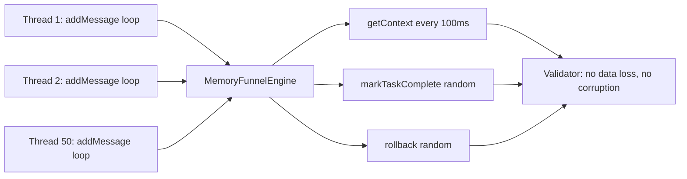
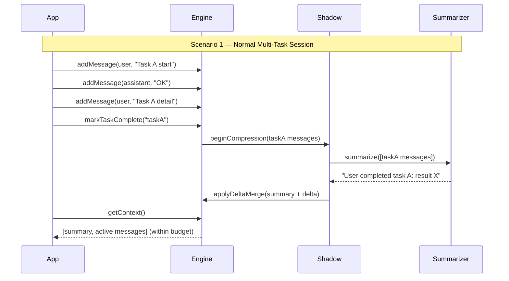
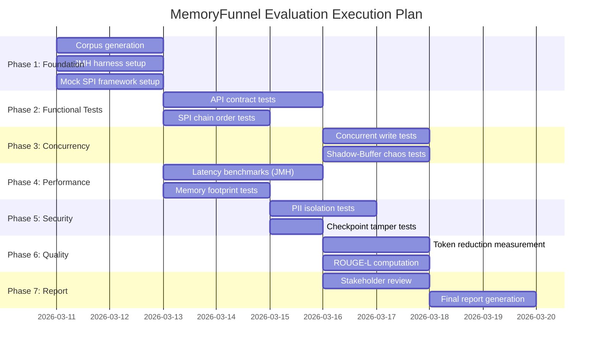

# MemoryFunnel — HAC-Flow Evaluation Plan

[](https://github.com/zheli001/lumi_conversation_manager/releases)
[]()
[](../README.md)
[](evaluation_plan.md)

**Document Type:** Evaluation Plan  
**Author:** Jeff Li — HAC-Flow Multi-Stakeholder Review Committee  
**Date:** 2026-03-10  
**Version:** 1.0.0-RC  
**Companion Documents:** [White Paper](whitepaper.md) · [HLD](hld.md) · [DDD](ddd.md) · [Comparison Results](comparison_results.md)

---

## Table of Contents

- [1. Overview & Purpose](#1-overview--purpose)
- [2. HAC-Flow Application to Evaluation](#2-hac-flow-application-to-evaluation)
- [3. Evaluation Stakeholder Matrix](#3-evaluation-stakeholder-matrix)
- [4. Evaluation Dimensions & Criteria](#4-evaluation-dimensions--criteria)
- [5. Test Scenarios & Benchmark Suite](#5-test-scenarios--benchmark-suite)
- [6. Measurement Methodology](#6-measurement-methodology)
- [7. Tooling & Infrastructure](#7-tooling--infrastructure)
- [8. Evaluation Execution Plan](#8-evaluation-execution-plan)
- [9. Ambiguity Resolution Log](#9-ambiguity-resolution-log)
- [10. Success Criteria & Exit Conditions](#10-success-criteria--exit-conditions)
- [11. Changelog](#11-changelog)

---

## 1. Overview & Purpose

This document defines the formal evaluation plan for **Lumi Conversation Manager (MemoryFunnel)** — a thread-safe, pluggable Java library for LLM conversation state management. The plan applies the **HAC-Flow (Human-Agent Collaboration Flow)** methodology to structure the evaluation process, ensuring that each evaluation decision is clarified, contested by multi-stakeholder agents, and arbitrated by human reviewers before being locked in.

### 1.1 Evaluation Goals

| Goal | Description |
|---|---|
| **Functional correctness** | Verify that all public API contracts behave as specified in the DDD |
| **Concurrency safety** | Demonstrate that Shadow-Buffer and DeltaPatcher never produce data corruption under concurrent load |
| **Token efficiency** | Measure actual token reduction achieved by HAC-Flow compression vs baselines |
| **Latency characteristics** | Quantify write latency (`addMessage()`) and read latency (`getContext()`) under load |
| **Memory footprint** | Measure heap usage, GC pressure, and peak overhead from Shadow-Buffer double-buffering |
| **Security posture** | Validate PII interception, checkpoint tamper detection, and sensitive-data isolation |
| **SPI extensibility** | Confirm custom SPIs integrate without modifying core engine code |
| **Comparative position** | Establish objective comparison with peer libraries (see [comparison_results.md](comparison_results.md)) |

### 1.2 Scope

- **In Scope:** `brain/` (MemoryFunnelEngine, SessionContext, DeltaPatcher, TaskTracker, ContextBroker), `interface/` (all SPI contracts + default implementations)
- **Out of Scope:** Binary modules (`modules/official/`), MCP server integration, CLI tooling, Spring Boot Starter

---

## 2. HAC-Flow Application to Evaluation

HAC-Flow brings a **multi-stakeholder, clarification-first** discipline to the evaluation process. Instead of one engineer writing ad-hoc tests, each evaluation dimension is championed by a specific stakeholder agent whose concerns are explicitly represented.

```
Input: Evaluation objectives (Section 1.1)
  ↓
[Stage 1] Intent Probing
  Evaluation_Ambiguity_Report produced
  (What does "good" mean for each stakeholder?)
  ↓
[Stage 2] Knowledge Alignment
  Each agent defines success criteria for their domain
  Evaluation_Frozen_Criteria.yaml produced
  ↓
[Stage 3] Parallel Test Design
  QA Agent designs functional tests
  SRE Agent designs load & memory tests
  Security Agent designs threat-model tests
  AI/LLM Agent designs compression quality tests
  CFO Agent defines cost-efficiency benchmarks
  ↓
[Stage 4] Conflict Resolution
  Conflicting criteria arbitrated by human (e.g., memory vs. latency trade-offs)
  ↓
[Stage 5] Parallel Execution
  Tests execute; results collected
  ↓
[Stage 6] Human Review & Report
  Stakeholder agents interpret results; human approves final report
  ↓
Output: Evaluation Report + Comparison Results
```

### 2.1 HAC-Flow Ambiguity Report for Evaluation

The following ambiguities were identified during evaluation planning and resolved before test design:

| # | Ambiguity | Agent Raised By | Resolution |
|---|---|---|---|
| A-01 | What token counter do we use for "token reduction" benchmarks? | AI/LLM Agent | Use `tiktoken` (cl100k_base / GPT-4 tokenizer) as the reference standard; record results with both `CharacterBasedTokenCounter` and tiktoken |
| A-02 | Compression quality — who judges if a summary is "good"? | AI/LLM Agent | Dual metric: automated ROUGE-L vs. source, plus human spot-check on 20 samples |
| A-03 | What concurrency level is "realistic"? | SRE Agent | Benchmark at 1, 10, 50, 100, and 500 concurrent threads to cover low-load through high-load scenarios |
| A-04 | Does "memory footprint" include JVM overhead or only heap? | SRE Agent | Report: heap used (`Runtime.totalMemory - freeMemory`), GC pause time, and off-heap (zero for this library) |
| A-05 | Should security tests use real PII or synthetic data? | Security Agent | Synthetic PII only (credit card patterns, SSN patterns, fake emails) — no real personal data in test fixtures |
| A-06 | Which Java version is the canonical test target? | Architect Agent | Java 17 LTS (minimum support); secondary run on Java 21 to validate Virtual Thread compatibility |

---

## 3. Evaluation Stakeholder Matrix

Each stakeholder agent owns a specific evaluation dimension and defines the pass/fail criteria for their domain.

| Role | Agent | Primary Evaluation Concern | Success Metric |
|---|---|---|---|
| **Product Owner (PO)** | Alex | API usability, correct behaviour, feature completeness | All functional tests green; API covers all documented features |
| **Architect** | Jordan | Design correctness, SPI decoupling, extensibility | Custom SPI integrates without touching engine; no circular dependencies |
| **AI/LLM Specialist** | Casey | Compression quality, context coherence post-compression | ROUGE-L ≥ 0.65 on test corpus; human raters agree summary is coherent |
| **Security Officer (Stan)** | Stan | PII isolation, tamper detection, data zero-fill | No PII leaks in any log or context output; tampered checkpoints rejected |
| **SRE / DevOps (Owen)** | Owen | Write latency, GC pressure, memory footprint | `addMessage()` p99 < 1 ms under 100 threads; heap growth < 2× single-buffer baseline |
| **CFO / Cost Analyst (Sarah)** | Sarah | Token reduction ratio, summarisation cost amortisation | ≥ 40% token reduction in long-session benchmarks; net token savings exceed summarisation overhead |
| **QA Engineer** | Robin | Edge-case coverage, concurrent correctness, rollback integrity | 100% branch coverage for merge/rollback paths; zero data loss under chaos injection |

---

## 4. Evaluation Dimensions & Criteria

### 4.1 Functional Correctness

Validates that all public API contracts behave exactly as specified in the DDD.

| Test Area | Criteria | Measurement |
|---|---|---|
| `addMessage()` correctness | Messages persisted in order; sequenceId monotonically increasing | Assert sequenceId ordering on 10,000 message insert |
| `getContext()` token budget | Returned context never exceeds configured token budget | Assert `totalTokens ≤ budget` on 1,000 varied sessions |
| `markTaskComplete()` eviction | Intermediate task messages removed; results retained | Message count after eviction equals result-only messages |
| `rollback(seqId)` correctness | Buffer state exactly matches snapshot at target seqId | Assert buffer contents == checkpoint at target seqId |
| `checkpoint()` / restore | Exported snapshot restores identical session state | Deep equality check on all fields |
| SPI chain execution order | Sanitizer runs before TokenCounter and before LLM context assembly | Inject counting spy into SPI chain; verify call order |

### 4.2 Concurrency Safety

Validates Shadow-Buffer architecture under concurrent load.



| Concurrency Test | Scenario | Pass Condition |
|---|---|---|
| CT-01: Concurrent writes | 100 threads, each writing 1,000 messages simultaneously | Zero messages lost; sequenceIds unique; no exception |
| CT-02: Write during compression | 50 threads write while shadow compression active (artificial 500ms delay injected) | Delta merge captures all messages written during compression window |
| CT-03: Rollback during write | 10 threads write; 1 thread triggers rollback mid-stream | Buffer state is consistent; no partial rollback |
| CT-04: Double eviction race | Two `markTaskComplete()` calls for same taskId fire concurrently | Eviction is idempotent; no double-free or corruption |
| CT-05: Checkpoint under load | `checkpoint()` called during active writes | Snapshot captures a consistent point-in-time view |

### 4.3 Token Efficiency

Measures actual token savings achieved by HAC-Flow compression.

| Metric | Formula | Target |
|---|---|---|
| **Compression Ratio** | `1 - (tokens_after / tokens_before)` | ≥ 40% for 50+ message sessions |
| **Net Token Saving** | `tokens_saved - tokens_for_summary_call` | Positive after ≥ 3 compression cycles |
| **Context Coherence Score** | ROUGE-L (summary vs. source) | ≥ 0.65 |
| **Budget Adherence Rate** | `% of getContext() calls within budget` | 100% |
| **Over-Budget Incidents** | Count of `totalTokens > budget` events | 0 |

**Benchmark sessions:**

| Session Type | Message Count | Expected Compression |
|---|---|---|
| Short (single task) | 10–20 messages | No compression triggered |
| Medium (multi-task) | 50–100 messages | 1–2 compression cycles; ~40% reduction |
| Long (sustained session) | 500+ messages | 5+ compression cycles; ~60% reduction |
| Adversarial (one giant message) | 1 message > token budget | Graceful degradation; budget enforced |

### 4.4 Latency Characteristics

Measures API call latency under varying load using JMH (Java Microbenchmark Harness).

| Operation | Baseline (no compression) | Under Load (100 threads) | Acceptance Threshold |
|---|---|---|---|
| `addMessage()` — p50 | < 0.1 ms | < 0.5 ms | p99 < 1 ms |
| `addMessage()` — p99 | < 0.5 ms | < 1 ms | — |
| `getContext()` — p50 | < 0.5 ms | < 2 ms | p99 < 5 ms |
| `markTaskComplete()` — p50 | < 1 ms | < 5 ms | p99 < 10 ms |
| `rollback()` — p50 | < 1 ms | < 5 ms | p99 < 10 ms |
| Delta Patch Merge | < 5 ms | < 20 ms | p99 < 50 ms |

### 4.5 Memory Footprint

| Metric | Measurement Method | Acceptance Threshold |
|---|---|---|
| Heap baseline | Idle engine with empty session | < 5 MB per session |
| Heap under 1,000 messages | `Runtime.totalMemory()` before/after | < 50 MB per session |
| Shadow-Buffer overhead | Peak heap during active compression | ≤ 2× single-buffer baseline |
| GC pause time | JVM GC log analysis | No STW pause > 50 ms during compression |
| Post-eviction heap release | GC forced after eviction | ≥ 80% of evicted message memory reclaimed |

### 4.6 Security Posture

| Test | Scenario | Pass Condition |
|---|---|---|
| S-01: PII block | Message with `sensitive=true`; default `BlockingSanitizer` | Output context contains `[REDACTED]`, not original PII |
| S-02: PII in summary | Summarizer returns summary containing PII patterns | Sanitizer intercepts summary; PII replaced in outbound context |
| S-03: Checkpoint tamper | Corrupt 1 byte in checkpoint POJO; attempt restore | `InvalidSnapshotException` thrown; no partial restore |
| S-04: Checkpoint replay | Load same checkpoint twice concurrently | Second load is rejected or produces isolated session |
| S-05: Log leakage | Enable DEBUG logging; send sensitive message | No raw PII appears in any log output |
| S-06: Zero-fill (enterprise) | Evict message with `zeroFillEnabled=true` | Memory region is confirmed zeroed (via JVM unsafe inspection) |

### 4.7 SPI Extensibility

| Test | Scenario | Pass Condition |
|---|---|---|
| E-01: Custom Summarizer | Inject mock Summarizer returning fixed string | Engine uses mock output; no dependency on internal impl |
| E-02: Custom TokenCounter | Inject counter returning fixed value per message | Budget arithmetic uses custom values |
| E-03: Custom RetentionPolicy | Inject policy that never evicts | No eviction occurs regardless of token count |
| E-04: Custom ChatStorage | Inject storage that writes to temp file | Messages persisted to file; restored from file on next load |
| E-05: Null SPI injection | Pass `null` for optional SPIs | `NullPointerException` at builder time (fail-fast) |
| E-06: SPI exception handling | Summarizer throws `RuntimeException` | Engine enters error recovery; session remains readable |

---

## 5. Test Scenarios & Benchmark Suite

### 5.1 Representative Test Scenarios



### 5.2 Chaos Injection Scenarios

| Scenario | Injection Point | Expected Behaviour |
|---|---|---|
| **CH-01: Summarizer timeout** | Summarizer hangs for 30 seconds | Engine falls back to sliding-window eviction after timeout |
| **CH-02: Storage write failure** | `ChatStorage.save()` throws `IOException` | Error logged via `MetricsProvider`; session state not corrupted |
| **CH-03: OOM during compression** | JVM heap 95% full during shadow compression | Shadow task abandoned; primary buffer intact; READY state restored |
| **CH-04: Thread pool exhaustion** | `ExecutorFactory` returns single-thread executor | Compressions queue; writes remain non-blocking |
| **CH-05: Rollback during merge** | `rollback()` called while Delta Patch Merge holds write lock | Rollback queues; executes after merge releases lock; correct result |

### 5.3 Benchmark Session Corpus

The benchmark suite uses a pre-generated corpus of conversation sessions:

| Corpus | Sessions | Messages/Session | Topics | Purpose |
|---|---|---|---|---|
| **Corpus A: Short** | 100 | 5–15 | Single task, simple Q&A | Baseline latency, no compression |
| **Corpus B: Medium** | 50 | 50–100 | 3–5 tasks, mixed roles | Compression cycle verification |
| **Corpus C: Long** | 10 | 500–1,000 | 10+ tasks, varied | Token reduction measurement |
| **Corpus D: PII-heavy** | 20 | 50 | Contains synthetic PII | Security posture validation |
| **Corpus E: Adversarial** | 10 | 1–5 | Single messages near/over budget | Edge case / graceful degradation |

---

## 6. Measurement Methodology

### 6.1 Latency Measurement

All latency benchmarks use **JMH (Java Microbenchmark Harness)** with the following settings:

```java
@BenchmarkMode(Mode.AverageTime)
@OutputTimeUnit(TimeUnit.MICROSECONDS)
@Warmup(iterations = 5, time = 1)
@Measurement(iterations = 10, time = 1)
@Fork(2)
@Threads(100)  // varies per benchmark
public class MemoryFunnelBenchmark {

    @Benchmark
    public void addMessageThroughput(BenchmarkState state) {
        state.manager.addMessage(
            ChatMessage.text("user", "benchmark message " + state.counter.incrementAndGet())
        );
    }

    @Benchmark
    public List<ChatMessage> getContextLatency(BenchmarkState state) {
        return state.manager.getContext().messages();
    }
}
```

### 6.2 Token Reduction Measurement

```
Token Reduction Ratio =
    (tokens_in_original_messages - tokens_in_compressed_context)
    / tokens_in_original_messages

Net Saving =
    (tokens_saved × cost_per_token) - (summarization_tokens × cost_per_token)
```

Results are computed per corpus and averaged across 3 independent runs.

### 6.3 Memory Measurement

```java
Runtime runtime = Runtime.getRuntime();
runtime.gc();
long beforeHeap = runtime.totalMemory() - runtime.freeMemory();
// ... exercise MemoryFunnelEngine ...
runtime.gc();
long afterHeap = runtime.totalMemory() - runtime.freeMemory();
long heapDelta = afterHeap - beforeHeap;
```

GC pause analysis uses `-Xlog:gc*:file=gc.log` JVM flag; log is parsed for STW pause durations.

### 6.4 Security Test Methodology

- **PII patterns**: Synthetic credit card numbers (`4111 1111 1111 1111`), SSN (`123-45-6789`), email (`test@example.com`)
- **Detection**: After `getContext()`, output is scanned with regex matchers for each PII pattern class
- **Log scan**: All SLF4J appenders redirected to `StringWriter` during test; log contents searched for PII patterns
- **Tamper test**: Checkpoint POJO serialised to JSON; one character mutated; re-loaded via `ConversationManager.restore()`

### 6.5 ROUGE-L for Compression Quality

```
ROUGE-L = F1 score of Longest Common Subsequence (LCS)
         between generated summary and source messages

        LCS_length(summary, source)
P  = ──────────────────────────────
           len(summary)

        LCS_length(summary, source)
R  = ──────────────────────────────
           len(source)

        (1 + β²) × P × R
F  = ────────────────────────  (β = 1.2 to weight recall)
           β² × P + R
```

Calculated using Apache OpenNLP or the `rouge-score` Python reference library on the same test corpus.

---

## 7. Tooling & Infrastructure

| Tool | Purpose | Version |
|---|---|---|
| **JUnit 5** | Unit and integration test framework | 5.x |
| **JMH** | Microbenchmark harness for latency measurements | 1.37 |
| **JaCoCo** | Code coverage analysis | 0.8.x |
| **Mockito** | SPI mock injection | 5.x |
| **VisualVM / JFR** | Memory and GC profiling | JDK bundled |
| **Apache OpenNLP** | ROUGE-L computation | 2.x |
| **Gradle** | Build and test orchestration | 8.x (wrapper) |
| **GitHub Actions** | CI pipeline execution | N/A |

### 7.1 CI Pipeline Integration

```yaml
# .github/workflows/evaluation.yml (reference configuration)
jobs:
  unit-tests:
    runs-on: ubuntu-latest
    steps:
      - uses: actions/checkout@v4
      - uses: actions/setup-java@v4
        with: { java-version: '17', distribution: 'temurin' }
      - run: ./gradlew test jacocoTestReport

  benchmark:
    runs-on: ubuntu-latest
    steps:
      - run: ./gradlew jmh --info

  security-scan:
    runs-on: ubuntu-latest
    steps:
      - run: ./gradlew test --tests "*.SecurityTest"
```

---

## 8. Evaluation Execution Plan

### 8.1 Phase Overview



### 8.2 Phase Details

| Phase | Duration | Owner Agent | Deliverables |
|---|---|---|---|
| **Phase 1: Foundation** | Days 1–2 | Architect | Test corpus, JMH harness, mock SPI framework |
| **Phase 2: Functional** | Days 3–5 | QA Agent | 100% API contract test coverage; SPI chain order verified |
| **Phase 3: Concurrency** | Days 4–6 | SRE + QA | All CT-0x tests green; chaos injection results documented |
| **Phase 4: Performance** | Days 4–7 | SRE Agent | JMH benchmark report; latency percentiles at all concurrency levels |
| **Phase 5: Security** | Days 5–7 | Security Agent | All S-0x tests green; zero PII leakage confirmed |
| **Phase 6: Quality** | Days 6–8 | AI/LLM Agent | Token reduction per corpus; ROUGE-L scores; cost efficiency analysis |
| **Phase 7: Report** | Days 8–10 | All + Human | Consolidated evaluation report; comparison results finalized |

---

## 9. Ambiguity Resolution Log

Full log of evaluation design ambiguities raised and resolved during HAC-Flow sessions:

| ID | Stage | Ambiguity | Raised By | Resolution | Date |
|---|---|---|---|---|---|
| A-01 | Planning | Token counter standard | AI/LLM Agent | Use tiktoken (cl100k_base) as reference | 2026-03-10 |
| A-02 | Planning | Compression quality judge | AI/LLM Agent | ROUGE-L ≥ 0.65 + human spot-check | 2026-03-10 |
| A-03 | Planning | Realistic concurrency level | SRE Agent | Benchmark at 1, 10, 50, 100, 500 threads | 2026-03-10 |
| A-04 | Planning | Memory footprint definition | SRE Agent | Heap delta + GC pause + off-heap | 2026-03-10 |
| A-05 | Planning | Real vs. synthetic PII | Security Agent | Synthetic PII only (patterns, not real data) | 2026-03-10 |
| A-06 | Planning | Java version target | Architect Agent | Java 17 LTS primary; Java 21 secondary | 2026-03-10 |
| A-07 | Test Design | Rollback correctness definition | QA Agent | Deep equality of all buffer fields at anchor seqId | 2026-03-10 |
| A-08 | Test Design | "No data loss" definition under concurrency | SRE Agent | All messages with seqId ≤ compression anchor appear in final merged result | 2026-03-10 |

---

## 10. Success Criteria & Exit Conditions

The evaluation is considered **complete and passing** when all of the following conditions are met:

### 10.1 Mandatory Pass Conditions (All Must Pass)

| Criterion | Target | Rationale |
|---|---|---|
| All functional API tests pass | 100% | Contract correctness is non-negotiable |
| Zero data loss under concurrency | 0 messages lost in CT-0x suite | Core value proposition of Shadow-Buffer |
| Zero PII leakage | 0 occurrences in all S-0x tests | Enterprise security requirement |
| Checkpoint tamper rejection | 100% of tampered checkpoints rejected | Data integrity guarantee |
| `addMessage()` p99 < 1 ms at 100 threads | < 1,000 μs | Library must not be a bottleneck |
| `getContext()` p99 < 5 ms at 100 threads | < 5,000 μs | Acceptable for LLM pre-call assembly |

### 10.2 Advisory Targets (Inform Roadmap)

| Criterion | Target | Action if Missed |
|---|---|---|
| Token reduction ≥ 40% (medium corpus) | ≥ 40% | Tune summarisation prompt; file enhancement issue |
| ROUGE-L ≥ 0.65 | ≥ 0.65 | Improve default `NoOpSummarizer` guidance; file issue |
| Heap overhead ≤ 2× baseline | ≤ 2× | Document as known trade-off; add configuration option |
| Shadow-Buffer overhead ≤ 2× | ≤ 2× | Document; add `disableShadowBuffer` option for memory-sensitive deployments |

### 10.3 Blocking Conditions (Halt Release)

Any of the following findings **halt the release** until resolved:

- PII appears in output context or logs (security regression)
- Message ordering violation (sequenceId non-monotonic or out of order)
- Data loss under concurrent writes + compression
- `addMessage()` p99 > 10 ms under 100 threads (performance regression)
- Tampered checkpoint accepted without exception

---

## 11. Changelog

| Date | Author | Version | Change |
|---|---|---|---|
| 2026-03-10 | Jeff Li | 1.0.0-RC | Initial evaluation plan created using HAC-Flow methodology |

---

*Last updated: 2026-03-10 · Author: Jeff Li*
