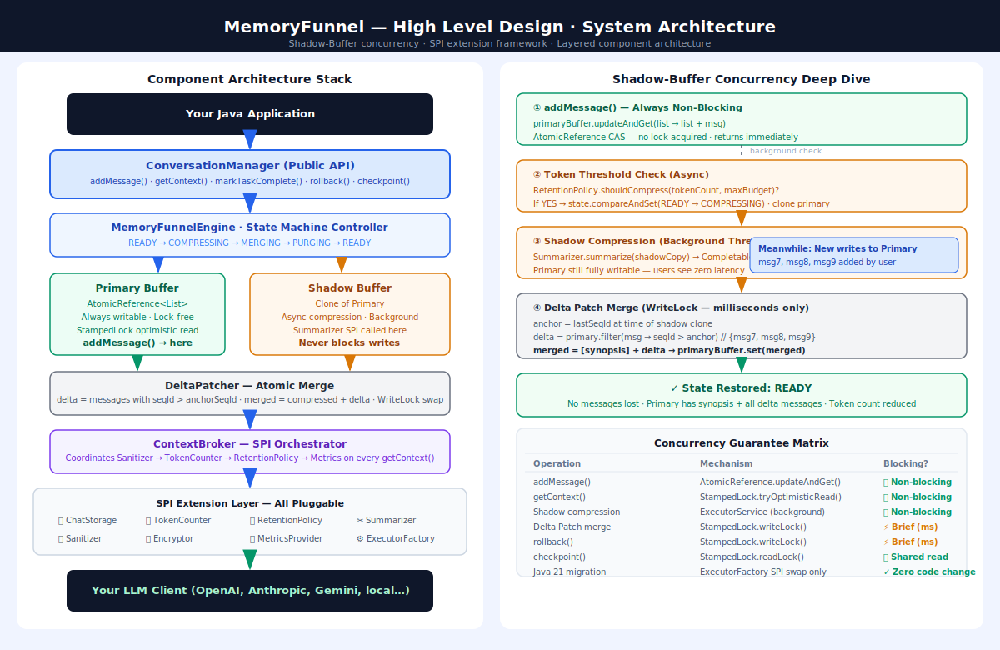

# MemoryFunnel — High Level Design (HLD)

**Document Type:** High Level Design (HLD)  
**Version:** 1.0.0-RC  
**Companion Documents:** [PRD / White Paper](whitepaper.md) · [Detailed Design](ddd.md)



---

## Table of Contents
- [1. System Overview](#1-system-overview)
- [2. Component Architecture](#2-component-architecture)
- [3. Shadow-Buffer Concurrency Architecture](#3-shadow-buffer-concurrency-architecture)
- [4. Engine State Machine](#4-engine-state-machine)
- [5. SPI Extension Framework](#5-spi-extension-framework)
- [6. Memory Layer Model](#6-memory-layer-model)
- [7. Data Flow Diagrams](#7-data-flow-diagrams)
- [8. Security Architecture](#8-security-architecture)
- [9. Observability Architecture](#9-observability-architecture)
- [10. Technology Stack & Dependencies](#10-technology-stack--dependencies)
- [11. Module & Package Structure](#11-module--package-structure)

---

## 1. System Overview

MemoryFunnel is a **single-JVM local Java library**. It has no network transport, no external service dependency, and no opinionated persistence. It is pure state management middleware.

```
Your Java Application
         │
         ▼
┌─────────────────────────────────────────────────────────────────────┐
│  MemoryFunnel Library (this project)                               │
│                                                                     │
│  ┌──────────────┐   ┌──────────────────┐   ┌────────────────────┐ │
│  │ Context      │   │ MemoryFunnel     │   │ Shadow-Buffer      │ │
│  │ Broker API   │──▶│ Engine           │──▶│ Async Engine       │ │
│  └──────────────┘   └──────────────────┘   └────────────────────┘ │
│         │                   │                       │              │
│         ▼                   ▼                       ▼              │
│  ┌──────────────────────────────────────────────────────────────┐  │
│  │  SPI Layer: Storage · Tokenizer · RetentionPolicy ·          │  │
│  │             Summarizer · Sanitizer · Encryptor · Metrics     │  │
│  └──────────────────────────────────────────────────────────────┘  │
└─────────────────────────────────────────────────────────────────────┘
         │
         ▼
  Your LLM Client (OpenAI, Anthropic, Gemini, local model, …)
```

**Key design principle:** The library prepares context; your code sends it. MemoryFunnel is never aware of which LLM you use.

---

## 2. Component Architecture

```
┌─────────────────────────────────────────────────────────────────────────┐
│ PUBLIC API LAYER                                                        │
│                                                                         │
│  ConversationManager           ContextResult                           │
│   ├── addMessage(msg)           ├── messages: List<ChatMessage>         │
│   ├── getContext() → Future     ├── totalTokens: int                    │
│   ├── markTaskComplete(taskId)  └── truncated: boolean                  │
│   ├── rollback(seqId)                                                   │
│   └── checkpoint() → Snapshot                                          │
└────────────────────────────────┬────────────────────────────────────────┘
                                 │
┌────────────────────────────────▼────────────────────────────────────────┐
│ ORCHESTRATION LAYER                                                     │
│                                                                         │
│  MemoryFunnelEngine (State Machine Controller)                          │
│   ├── SessionContext (Primary Buffer + Shadow Buffer container)         │
│   ├── ContextBroker (SPI orchestrator — bridges engine to all SPIs)     │
│   ├── TaskTracker (taskId lifecycle: ACTIVE → COMPLETING → EVICTED)     │
│   └── DeltaPatcher (Delta Patch merge algorithm)                        │
└────────────────────────────────┬────────────────────────────────────────┘
                                 │
┌────────────────────────────────▼────────────────────────────────────────┐
│ SPI LAYER                      (All pluggable — replaceable at runtime) │
│                                                                         │
│  ChatStorage         │ TokenCounter        │ RetentionPolicy            │
│  Summarizer          │ Sanitizer           │ Encryptor                  │
│  MetricsProvider     │ ExecutorFactory                                  │
└────────────────────────────────┬────────────────────────────────────────┘
                                 │
┌────────────────────────────────▼────────────────────────────────────────┐
│ DEFAULT IMPLEMENTATIONS        (Built-in; replaceable by user)          │
│                                                                         │
│  InMemoryStorage     │ CharacterBasedTokenCounter                       │
│  SlidingWindowPolicy │ BlockingSanitizer (PII block-all)                │
│  NoOpSummarizer      │ NoOpEncryptor      │ NoOpMetrics                  │
└─────────────────────────────────────────────────────────────────────────┘
```

### 2.1 ContextBroker — The SPI Orchestration Hub

`ContextBroker` is the central SPI orchestrator. It holds references to all pluggable services and provides a unified invocation surface for the engine:

```
Engine                          ContextBroker
  │  getContext(session)   →        │
  │                                 │──▶ Sanitizer.sanitize(messages)
  │                                 │──▶ TokenCounter.count(messages)
  │                                 │──▶ RetentionPolicy.apply(messages)
  │                                 │──▶ (if threshold hit) trigger shadow compression
  │  ◀─────────────────────────────│
```

---

## 3. Shadow-Buffer Concurrency Architecture

### 3.1 Dual-Buffer State Diagram

```
 addMessage() calls          getContext() calls
       │                           │
       ▼                           ▼
┌─────────────────────────────────────────┐
│ PRIMARY BUFFER (AtomicReference<List>)  │
│                                         │
│  [msg1][msg2][msg3][msg4][msg5][msg6]   │◀── always writable
│                                         │    zero-blocking on addMessage
└─────────────────┬───────────────────────┘
                  │  Token threshold crossed
                  ▼  (async; does NOT pause primary)
┌─────────────────────────────────────────┐
│ SHADOW BUFFER (clone of primary)        │
│                                         │
│  Summarizer.compress([msg1]...[msg4])   │  ← runs on background thread
│  → synopsis: "User asked about X..."   │
│                                         │
└─────────────────┬───────────────────────┘
                  │  Compression complete
                  ▼
         Delta Patch Merge
         (see Section 3.2)
                  │
                  ▼
┌─────────────────────────────────────────┐
│ PRIMARY BUFFER (after merge)            │
│                                         │
│  [synopsis][msg5][msg6][msg7][msg8]     │  ← atomic swap via AtomicReference.set()
│                                         │
└─────────────────────────────────────────┘
```

### 3.2 Delta Patch Merge Protocol

**Problem:** While shadow compression runs (may take 1–5 seconds via LLM API call), users continue adding messages to primary. These "delta" messages must not be lost during the atomic swap.

**Solution:**

```
Before shadow clone: lastSnapshotSeq = primary.lastSequenceId()  ← anchor

After shadow compression completes:
  delta = primary.filter(msg → msg.sequenceId > lastSnapshotSeq)
  mergedList = [compressed_synopsis] + delta

WRITE_LOCK (brief):
  primaryBuffer.set(mergedList)   ← atomic swap
RELEASE_LOCK
```

**Lock scope:** The write lock is held only during the `set()` call — microseconds. Incoming `addMessage()` calls queue during this window; they never block for the compression duration.

### 3.3 Concurrency Guarantee Matrix

| Operation | Mechanism | Blocking? |
|---|---|---|
| `addMessage()` | `AtomicReference.updateAndGet()` | Non-blocking (lock-free) |
| `getContext()` | `StampedLock.tryOptimisticRead()` | Non-blocking (optimistic) |
| `markTaskComplete()` | `StampedLock.readLock()` | Brief shared-lock |
| `rollback()` | `StampedLock.writeLock()` | Brief exclusive-lock |
| Delta Patch merge | `StampedLock.writeLock()` | Brief exclusive-lock |
| Shadow compression | `ExecutorService` (background) | Non-blocking on primary |
| `checkpoint()` | `StampedLock.readLock()` | Brief shared-lock |

---

## 4. Engine State Machine

The `MemoryFunnelEngine` transitions between four states. Only one background task (compression or eviction) runs at a time.

```
         ┌─────────────────────────────────────────────────┐
         │                                                 │
         ▼                                                 │
    ┌─────────┐                                            │
    │  READY  │ ◀────────────── addMessage() (normal)      │
    └────┬────┘                                            │
         │                                                 │
         │  Token threshold crossed                        │
         │  OR markTaskComplete() called                   │
         ▼                                                 │
    ┌───────────────┐                                      │
    │  COMPRESSING  │  Shadow-Buffer async summarization   │
    │  (background) │  Primary still accepts writes        │
    └───────┬───────┘                                      │
            │                                              │
            │  Compression done → Delta Patch Merge        │
            ▼                                              │
    ┌───────────────┐                                      │
    │   MERGING     │  WriteLock held (milliseconds)       │
    │   (atomic)    │  addMessage() briefly queued         │
    └───────┬───────┘                                      │
            │                                              │
            │  Merge complete                              │
            ▼                                              │
    ┌───────────────┐                                      │
    │   PURGING     │  Task-based eviction                 │
    │   (cleanup)   │  Removes obsolete task messages      │
    └───────┬───────┘                                      │
            │                                              │
            └─────────────────────────────────────────────┘
                              READY

    ┌─────────────────────┐
    │ ROLLBACK (terminal) │  Cancels shadow task; truncates primary from anchor seqId
    └─────────────────────┘
```

---

## 5. SPI Extension Framework

Each SPI is a Java `interface`. All SPI implementations must be **thread-safe**. The engine does not serialize calls to SPIs.

### 5.1 SPI Contracts Summary

| SPI Interface | Method | Contract |
|---|---|---|
| `ChatStorage` | `save(session, messages)` / `load(sessionId)` | Thread-safe; durable |
| `TokenCounter` | `count(text)` / `countAll(messages)` | Pure function; no state |
| `RetentionPolicy` | `shouldCompress(session, tokenCount)` / `evict(messages)` | Returns decision; no mutation |
| `Summarizer` | `summarize(messages)` → `CompletableFuture<String>` | Async; may call LLM API |
| `Sanitizer` | `sanitize(messages)` → `List<ChatMessage>` | Returns sanitised copy; never modifies in place |
| `Encryptor` | `encrypt(bytes)` / `decrypt(bytes)` | Symmetric; for checkpoint persistence |
| `MetricsProvider` | `record(event, value, tags)` | Fire-and-forget; never throws |
| `ExecutorFactory` | `createExecutor()` → `ExecutorService` | Java 17: thread pool · Java 21: Virtual Threads |

### 5.2 SPI Chain Execution Order

For every `getContext()` call:

```
1. RetentionPolicy.shouldCompress()   → decision
2. (if yes) → trigger Shadow-Buffer compression (async)
3. Sanitizer.sanitize(current messages)   → sanitised copy
4. TokenCounter.countAll(sanitised)       → current token count
5. RetentionPolicy.evict(sanitised)       → pruned list
6. MetricsProvider.record(...)
7. return ContextResult(prunedList, tokenCount, truncated flag)
```

---

## 6. Memory Layer Model

### 6.1 Context Window Assembly

When `getContext()` is called, the assembled context sent to the LLM has three logical sections:

```
┌─────────────────────────────────────────────────────────┐
│ HEADER ZONE (always included; pinned)                   │
│ • System prompt                                         │
│ • Permanent user preferences / identity context         │
│ Managed by: RetentionPolicy.pinned()                    │
├─────────────────────────────────────────────────────────┤
│ SYNOPSIS ZONE (compressed history)                      │
│ • "In earlier conversation: user asked about X, Y, Z"  │
│ • Produced by Summarizer SPI                            │
│ • May be empty if no compression has occurred           │
├─────────────────────────────────────────────────────────┤
│ ACTIVE BUFFER ZONE (recent messages)                    │
│ • Last N messages that fit within remaining token budget│
│ • Always includes current user message                  │
│ • Most recently evicted task messages are absent here   │
└─────────────────────────────────────────────────────────┘
```

### 6.2 Task Lifecycle Memory Zones

```
Task A (completed):
  [ACTIVE] msg1, msg2, msg3 (reasoning) → [EVICTED after task close]
  [RETAINED in synopsis] "Task A result: ..."

Task B (in progress):
  [ACTIVE] msg4, msg5, msg6 (current working set)
```

---

## 7. Data Flow Diagrams

### 7.1 addMessage() Flow

```
User calls addMessage(msg)
         │
         ▼
  msg.sequenceId assigned (AtomicLong.getAndIncrement)
         │
         ▼
  TaskTracker.register(msg.taskId) [if new taskId]
         │
         ▼
  primaryBuffer.updateAndGet(list → list + msg)   [lock-free]
         │
         ▼
  MetricsProvider.record("message.added", ...)
         │
         ▼
  [background check] TokenCounter.countAll() > threshold?
         │
         YES → trigger shadow compression (async, non-blocking)
         NO  → return immediately
```

### 7.2 getContext() Flow

```
User calls getContext()
         │
         ▼
  StampedLock.tryOptimisticRead()
         │
         ▼
  Sanitizer.sanitize(messages) → filtered copy
         │
         ▼
  Assemble [HEADER] + [SYNOPSIS] + [ACTIVE BUFFER]
         │
         ▼
  RetentionPolicy.evict(assembled) → prune to token budget
         │
         ▼
  TokenCounter.countAll(final list) → total token count
         │
         ▼
  MetricsProvider.record("context.assembled", tokenCount)
         │
         ▼
  return ContextResult(messages, tokenCount, truncated)
```

### 7.3 markTaskComplete() Flow

```
User calls markTaskComplete(taskId)
         │
         ▼
  TaskTracker.transition(taskId, ACTIVE → COMPLETING)
         │
         ▼
  RetentionPolicy.extractTaskSummary(messages for taskId)
         │
         ▼
  Summarizer.summarize(task messages) → synopsis [async]
         │
         ▼
  [on synopsis ready] primaryBuffer WriteLock:
    remove task messages, insert synopsis, TaskTracker → EVICTED
         │
         ▼
  MetricsProvider.record("task.evicted", taskId, tokensSaved)
```

---

## 8. Security Architecture

### 8.1 PII Zero-Trust Model

```
User message (may contain PII)
         │
         ▼
  addMessage(msg)  ← stored internally; NOT yet sanitised
         │  [PII remains in raw form in InMemoryStorage]
         │
         ▼
  getContext() call path:
         │
         ▼
  Sanitizer.sanitize()  ← ONLY sanitised copy exits the library
         │
         ▼
  ContextResult  ← safe to pass to LLM client
```

**PII never leaves the library unsanitised.** Raw storage is internal; only `ContextResult` is returned to the caller.

### 8.2 Checkpoint Encryption Flow

```
checkpoint() called
         │
         ▼
  SessionSnapshot.capture(engine) → POJO
         │
         ▼
  Jackson.serialize(snapshot) → JSON bytes
         │
         ▼
  Encryptor.encrypt(bytes) → encrypted blob  ← user-injected SPI
         │
         ▼
  ChatStorage.saveSnapshot(sessionId, encryptedBlob)
```

**Default:** `NoOpEncryptor` passes bytes through (plaintext). Enterprise deployment must inject an AES-256 or equivalent `Encryptor`.

### 8.3 Secret Value Handling

```java
// API keys passed to SPI implementations MUST use SecretValue wrapper
// SecretValue.toString() returns "[REDACTED]" — never the actual value
SecretValue apiKey = SecretValue.of(System.getenv("OPENAI_KEY"));

// Safe in logs, debug output, exception messages
log.info("Using key: {}", apiKey);  // → "Using key: [REDACTED]"
```

---

## 9. Observability Architecture

The `MetricsProvider` SPI allows connecting MemoryFunnel to any observability platform:

| Metric | Event Name | Tags |
|---|---|---|
| Messages added | `memory_funnel.message.added` | sessionId, role |
| Context assembled | `memory_funnel.context.assembled` | sessionId, tokenCount, truncated |
| Compression triggered | `memory_funnel.compression.triggered` | sessionId, reason (threshold/task) |
| Compression latency | `memory_funnel.compression.latency_ms` | sessionId |
| Delta patch applied | `memory_funnel.delta.merged` | sessionId, deltaSize |
| Task evicted | `memory_funnel.task.evicted` | sessionId, taskId, tokensSaved |
| Token budget usage | `memory_funnel.token.usage_pct` | sessionId |
| Checkpoint written | `memory_funnel.checkpoint.written` | sessionId, snapshotSize |

Default implementation: `NoOpMetricsProvider`. Drop-in: `PrometheusMetricsProvider` (optional module).

---

## 10. Technology Stack & Dependencies

### 10.1 Core Library

| Component | Technology | Version |
|---|---|---|
| Language | Java | 17 (→ 21 compatible) |
| Build | Gradle (Kotlin DSL) | 8.x |
| Concurrency | `java.util.concurrent` | JDK built-in |
| Serialisation (default) | None in core (POJO) | — |
| Testing | JUnit 5 + Mockito | Latest stable |

**Zero third-party runtime dependencies in core engine.** SPIs may depend on external libraries (Jackson, Redis client, etc.) — but those are in the SPI implementation modules, not in `brain/`.

### 10.2 Optional Modules

| Module | Dependency | Purpose |
|---|---|---|
| `storage-redis` | Jedis / Lettuce | Redis-backed `ChatStorage` |
| `storage-jdbc` | JDBC | SQL `ChatStorage` |
| `tokenizer-tiktoken` | tiktoken-java | OpenAI-accurate `TokenCounter` |
| `summarizer-openai` | OpenAI Java SDK | LLM-based `Summarizer` |
| `spring-boot-starter` | Spring Boot | Auto-configure `ConversationManager` bean |
| `metrics-prometheus` | Micrometer | Prometheus `MetricsProvider` |

---

## 11. Module & Package Structure

```
lumi_conversation_manager/
├── brain/                          ← Core engine (OPEN SOURCE)
│   └── src/main/java/com/lumi/conversation/
│       ├── api/
│       │   ├── ConversationManager.java     (public entry point)
│       │   └── ContextResult.java
│       ├── engine/
│       │   ├── MemoryFunnelEngine.java      (state machine)
│       │   ├── SessionContext.java          (shadow buffer)
│       │   ├── DeltaPatcher.java
│       │   └── TaskTracker.java
│       ├── model/
│       │   ├── ChatMessage.java             (record)
│       │   ├── ContentBlock.java            (record)
│       │   ├── SessionSnapshot.java
│       │   └── TaskState.java               (enum)
│       └── spi/
│           ├── ChatStorage.java
│           ├── TokenCounter.java
│           ├── RetentionPolicy.java
│           ├── Summarizer.java
│           ├── Sanitizer.java
│           ├── Encryptor.java
│           ├── MetricsProvider.java
│           └── ExecutorFactory.java
├── interface/                      ← SPI contract module + default impls
│   └── src/main/java/com/lumi/conversation/iface/
│       ├── defaults/
│       │   ├── InMemoryStorage.java
│       │   ├── CharacterBasedTokenCounter.java
│       │   ├── SlidingWindowRetentionPolicy.java
│       │   ├── BlockingSanitizer.java
│       │   └── NoOpMetricsProvider.java
│       └── builder/
│           └── ConversationManagerBuilder.java
├── examples/                       ← Reference usage examples
│   └── src/main/java/com/lumi/conversation/examples/
│       ├── BasicUsageExample.java
│       ├── MultiTaskExample.java
│       └── CheckpointRestoreExample.java
└── modules/                        ← Binary extension modules
    ├── official/                   ← Signed binary-only; no source
    └── sandbox/                    ← Community-contributed extensions
```
